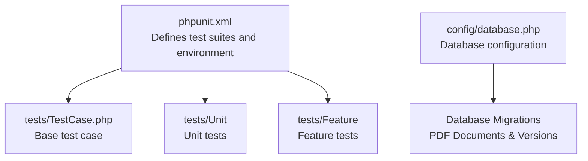
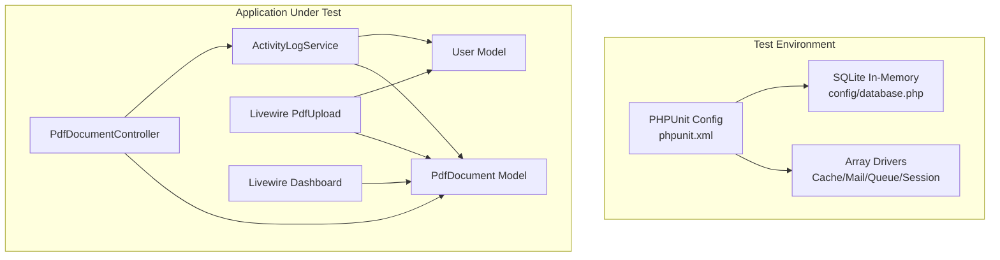
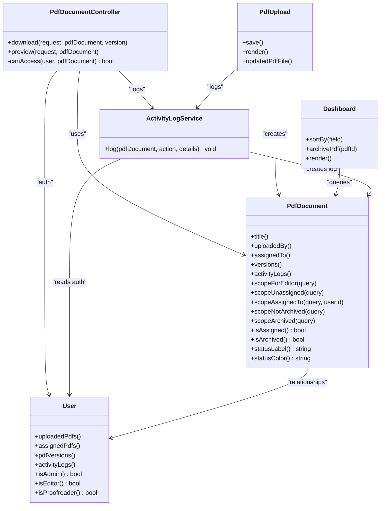

# Testing Strategy

<cite>
**Referenced Files in This Document**
- [phpunit.xml](file://phpunit.xml)
- [TestCase.php](file://tests/TestCase.php)
- [ActivityLogService.php](file://app/Services/ActivityLogService.php)
- [PdfDocument.php](file://app/Models/PdfDocument.php)
- [User.php](file://app/Models/User.php)
- [PdfDocumentController.php](file://app/Http/Controllers/PdfDocumentController.php)
- [PdfUpload.php](file://app/Livewire/PdfUpload.php)
- [Dashboard.php](file://app/Livewire/Dashboard.php)
- [database.php](file://config/database.php)
- [2024_06_10_120000_create_pdf_documents_table.php](file://database/migrations/2024_06_10_120000_create_pdf_documents_table.php)
- [2024_06_10_130000_create_pdf_versions_table.php](file://database/migrations/2024_06_10_130000_create_pdf_versions_table.php)
</cite>

## Table of Contents
1. [Introduction](#introduction)
2. [Project Structure](#project-structure)
3. [Core Components](#core-components)
4. [Architecture Overview](#architecture-overview)
5. [Detailed Component Analysis](#detailed-component-analysis)
6. [Dependency Analysis](#dependency-analysis)
7. [Performance Considerations](#performance-considerations)
8. [Troubleshooting Guide](#troubleshooting-guide)
9. [Conclusion](#conclusion)
10. [Appendices](#appendices)

## Introduction
This document defines a comprehensive testing strategy for the PDF correction system. It covers unit testing for individual components and services, feature testing for user workflows and business processes, best practices for test organization, mocking strategies, and assertion patterns. It also documents continuous integration setup, automated testing pipelines, test coverage guidelines, quality metrics, database strategies, test data management, performance and load testing approaches, and debugging and troubleshooting procedures.

## Project Structure
The testing structure follows Laravel conventions with separate directories for unit and feature tests. The PHPUnit configuration defines two test suites and sets environment variables optimized for fast, deterministic testing, including an in-memory SQLite database.

**Diagram sources**
- [phpunit.xml:1-32](file://phpunit.xml#L1-L32)
- [TestCase.php:1-11](file://tests/TestCase.php#L1-L11)
- [database.php:1-93](file://config/database.php#L1-L93)
- [2024_06_10_120000_create_pdf_documents_table.php:1-32](file://database/migrations/2024_06_10_120000_create_pdf_documents_table.php#L1-L32)
- [2024_06_10_130000_create_pdf_versions_table.php:1-29](file://database/migrations/2024_06_10_130000_create_pdf_versions_table.php#L1-L29)

**Section sources**
- [phpunit.xml:1-32](file://phpunit.xml#L1-L32)
- [TestCase.php:1-11](file://tests/TestCase.php#L1-L11)

## Core Components
This section identifies the primary components under test and their roles in the system.

- Models
  - PdfDocument: Represents a PDF document with lifecycle states, ownership, assignment, and versioning.
  - User: Authentication and authorization model with role-based access control.
- Services
  - ActivityLogService: Centralized logging of user actions for auditability.
- Controllers
  - PdfDocumentController: Handles PDF preview and download with access control and activity logging.
- Livewire Components
  - PdfUpload: Uploads PDFs, creates document/version records, and logs activity.
  - Dashboard: Filters, sorts, paginates, and archives PDFs with role-aware visibility.

Key testing targets include:
- Model validation and scopes
- Authorization logic in controllers and Livewire components
- File handling and storage paths
- Activity logging correctness
- Pagination and filtering behavior

**Section sources**
- [PdfDocument.php:1-130](file://app/Models/PdfDocument.php#L1-L130)
- [User.php:1-71](file://app/Models/User.php#L1-L71)
- [ActivityLogService.php:1-31](file://app/Services/ActivityLogService.php#L1-L31)
- [PdfDocumentController.php:1-82](file://app/Http/Controllers/PdfDocumentController.php#L1-L82)
- [PdfUpload.php:1-96](file://app/Livewire/PdfUpload.php#L1-L96)
- [Dashboard.php:1-92](file://app/Livewire/Dashboard.php#L1-L92)

## Architecture Overview
The testing architecture leverages Laravel’s built-in testing helpers, with a focus on isolation and determinism. Controllers and Livewire components depend on models and services, while services rely on facades for authentication and request context. The test environment uses an in-memory SQLite database and array-backed drivers for cache, mail, queues, and sessions.

**Diagram sources**
- [phpunit.xml:1-32](file://phpunit.xml#L1-L32)
- [database.php:1-93](file://config/database.php#L1-L93)
- [PdfDocumentController.php:1-82](file://app/Http/Controllers/PdfDocumentController.php#L1-L82)
- [PdfUpload.php:1-96](file://app/Livewire/PdfUpload.php#L1-L96)
- [Dashboard.php:1-92](file://app/Livewire/Dashboard.php#L1-L92)
- [ActivityLogService.php:1-31](file://app/Services/ActivityLogService.php#L1-L31)
- [PdfDocument.php:1-130](file://app/Models/PdfDocument.php#L1-L130)
- [User.php:1-71](file://app/Models/User.php#L1-L71)

## Detailed Component Analysis

### Unit Testing Strategy
- Model unit tests
  - Validate fillable attributes and casts.
  - Verify relationship definitions and scopes (ownership, assignment, archival, status filters).
  - Assert computed label/color helpers for status.
- Service unit tests
  - Mock authentication and request context to isolate logging behavior.
  - Verify log entries are persisted with correct action, user, and IP.
- Controller unit tests
  - Use route model binding and mock authorization to test access control.
  - Validate response types (download vs inline file) and error handling (403/404).
- Livewire component unit tests
  - Simulate form submission and file upload events.
  - Verify model creation, version creation, and activity logging dispatch.

Best practices:
- Keep tests small and focused on a single behavior.
- Use factories or manual fixtures for predictable data.
- Prefer assertions on outcomes (database rows, dispatched events, logged actions) over implementation details.

**Section sources**
- [PdfDocument.php:1-130](file://app/Models/PdfDocument.php#L1-L130)
- [User.php:1-71](file://app/Models/User.php#L1-L71)
- [ActivityLogService.php:1-31](file://app/Services/ActivityLogService.php#L1-L31)
- [PdfDocumentController.php:1-82](file://app/Http/Controllers/PdfDocumentController.php#L1-L82)
- [PdfUpload.php:1-96](file://app/Livewire/PdfUpload.php#L1-L96)
- [Dashboard.php:1-92](file://app/Livewire/Dashboard.php#L1-L92)

### Feature Testing Strategy
- End-to-end user workflows
  - Upload PDF: Submit form, validate file constraints, assert document/version creation, and activity log entry.
  - Preview/download PDF: Authenticate as different roles, verify access control, and validate response behavior.
  - Dashboard filtering/sorting/archiving: Apply filters, sort by fields, and assert pagination and archival logic.
- Assertion patterns
  - Use assertions for HTTP status codes, JSON responses (where applicable), Blade rendering, and Livewire emitted notifications.
  - Validate database state after actions (rows inserted/deleted, timestamps updated).
- Mocking strategies
  - Mock Storage facade for file operations to avoid disk I/O.
  - Mock Auth facade to simulate different user roles and permissions.
  - Use database transactions and seeds to maintain test isolation.

**Section sources**
- [PdfUpload.php:1-96](file://app/Livewire/PdfUpload.php#L1-L96)
- [PdfDocumentController.php:1-82](file://app/Http/Controllers/PdfDocumentController.php#L1-L82)
- [Dashboard.php:1-92](file://app/Livewire/Dashboard.php#L1-L92)

### Continuous Integration and Automated Pipelines
- Test suites
  - Two suites defined: Unit and Feature. Run them separately to optimize feedback loops.
- Environment configuration
  - APP_ENV set to testing.
  - CACHE_DRIVER, MAIL_MAILER, QUEUE_CONNECTION, SESSION_DRIVER set to array for speed and determinism.
  - DB_CONNECTION set to sqlite with in-memory database for rapid iteration.
- Suggested CI steps
  - Install dependencies.
  - Prepare test database (migrate and seed).
  - Run PHPUnit suites.
  - Collect coverage and enforce thresholds.
  - Optional: Run linters and static analysis.

**Section sources**
- [phpunit.xml:1-32](file://phpunit.xml#L1-L32)

### Test Coverage Guidelines and Quality Metrics
- Coverage targets
  - Aim for >80% overall coverage; prioritize critical paths (>90% for controllers/services/business logic).
- Coverage collection
  - Enable coverage reporting via PHPUnit configuration and integrate with CI.
- Quality gates
  - Enforce minimum coverage thresholds per suite.
  - Track churn and regression indicators.

[No sources needed since this section provides general guidance]

### Testing Database Strategies and Test Data Management
- Database driver
  - SQLite in-memory database ensures fast, isolated runs without cross-test contamination.
- Migrations and seeds
  - Use migrations to define schema and seeders to populate base data for tests.
- Factories
  - Define factories for PdfDocument, PdfVersion, User, and Title to generate realistic test data.
- Transactions and snapshots
  - Wrap tests in transactions and roll back to keep state pristine.
- Assertions
  - Assert exact counts, timestamps, and foreign keys to validate referential integrity.

**Section sources**
- [database.php:1-93](file://config/database.php#L1-L93)
- [2024_06_10_120000_create_pdf_documents_table.php:1-32](file://database/migrations/2024_06_10_120000_create_pdf_documents_table.php#L1-L32)
- [2024_06_10_130000_create_pdf_versions_table.php:1-29](file://database/migrations/2024_06_10_130000_create_pdf_versions_table.php#L1-L29)

### Performance Testing and Load Testing Approaches
- Unit and feature tests
  - Focus on correctness; keep heavy I/O out of unit tests.
- Endurance and scalability
  - Use external tools (e.g., Artillery, K6) to simulate concurrent uploads/downloads and dashboard queries.
  - Measure response times, throughput, and error rates under load.
- Observability
  - Monitor queue backlogs, database connection pools, and storage latency.
- Optimization signals
  - Identify slow queries via test profiling and adjust indexing or caching.

[No sources needed since this section provides general guidance]

### Debugging Techniques and Test Troubleshooting Procedures
- Logging
  - Enable verbose PHPUnit output and review logs for failures.
- Database inspection
  - Dump schema and recent rows during failing tests to diagnose state issues.
- Mock verification
  - Confirm mocks were invoked with expected arguments and order.
- Isolation checks
  - Temporarily disable transactions or seeds to reproduce flaky tests.
- CI parity
  - Match CI environment variables and PHP versions locally to avoid environment drift.

[No sources needed since this section provides general guidance]

## Dependency Analysis
This section maps dependencies among components under test and highlights areas requiring careful mocking.

**Diagram sources**
- [PdfDocumentController.php:1-82](file://app/Http/Controllers/PdfDocumentController.php#L1-L82)
- [PdfUpload.php:1-96](file://app/Livewire/PdfUpload.php#L1-L96)
- [Dashboard.php:1-92](file://app/Livewire/Dashboard.php#L1-L92)
- [ActivityLogService.php:1-31](file://app/Services/ActivityLogService.php#L1-L31)
- [PdfDocument.php:1-130](file://app/Models/PdfDocument.php#L1-L130)
- [User.php:1-71](file://app/Models/User.php#L1-L71)

## Performance Considerations
- Favor array-backed drivers for cache, mail, queues, and sessions to minimize overhead.
- Use lightweight assertions and avoid unnecessary database writes in unit tests.
- Batch operations in feature tests where appropriate to reduce test runtime.
- Profile slow tests and refactor shared setup logic into fixtures or dedicated test helpers.

[No sources needed since this section provides general guidance]

## Troubleshooting Guide
Common issues and resolutions:
- Unauthorized access errors
  - Verify role-based access logic in controllers and Livewire components.
  - Ensure Auth facade is properly mocked in tests.
- Missing files or 404 responses
  - Confirm Storage facade is mocked and file paths are constructed correctly.
- Stale database state
  - Use transaction rollbacks or clean seeds between tests.
- Slow test runs
  - Reduce disk I/O, enable array drivers, and avoid redundant migrations.

**Section sources**
- [PdfDocumentController.php:1-82](file://app/Http/Controllers/PdfDocumentController.php#L1-L82)
- [PdfUpload.php:1-96](file://app/Livewire/PdfUpload.php#L1-L96)
- [Dashboard.php:1-92](file://app/Livewire/Dashboard.php#L1-L92)

## Conclusion
A robust testing strategy balances unit and feature tests, enforces strong coverage and quality gates, and leverages an efficient test environment. By focusing on clear assertions, disciplined mocking, and scalable database strategies, the system can maintain reliability as it evolves. Continuous integration pipelines should automate test execution and coverage reporting to sustain long-term quality.

[No sources needed since this section summarizes without analyzing specific files]

## Appendices

### Appendix A: Example Test Organization Outline
- Unit tests
  - Models: Validation, relationships, scopes, computed helpers.
  - Services: Activity logging behavior with mocked context.
  - Controllers: Access control, response types, error handling.
- Feature tests
  - Workflows: Upload, preview, download, archive, filter/sort.
  - Role scenarios: Admin/editor/proofreader.
  - Edge cases: Missing files, invalid versions, unauthorized actions.

[No sources needed since this section provides general guidance]