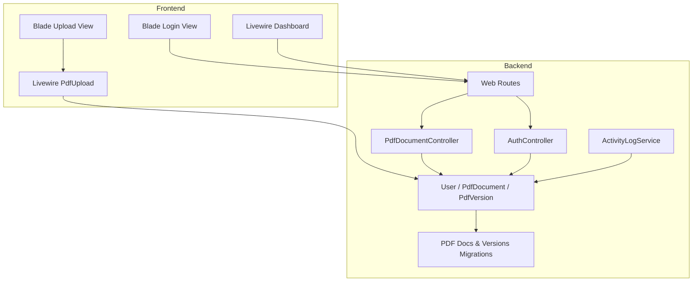
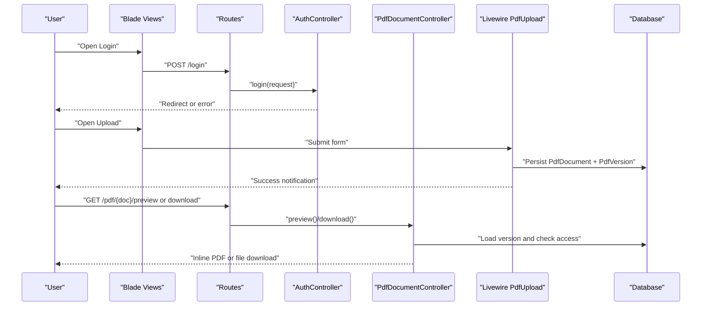
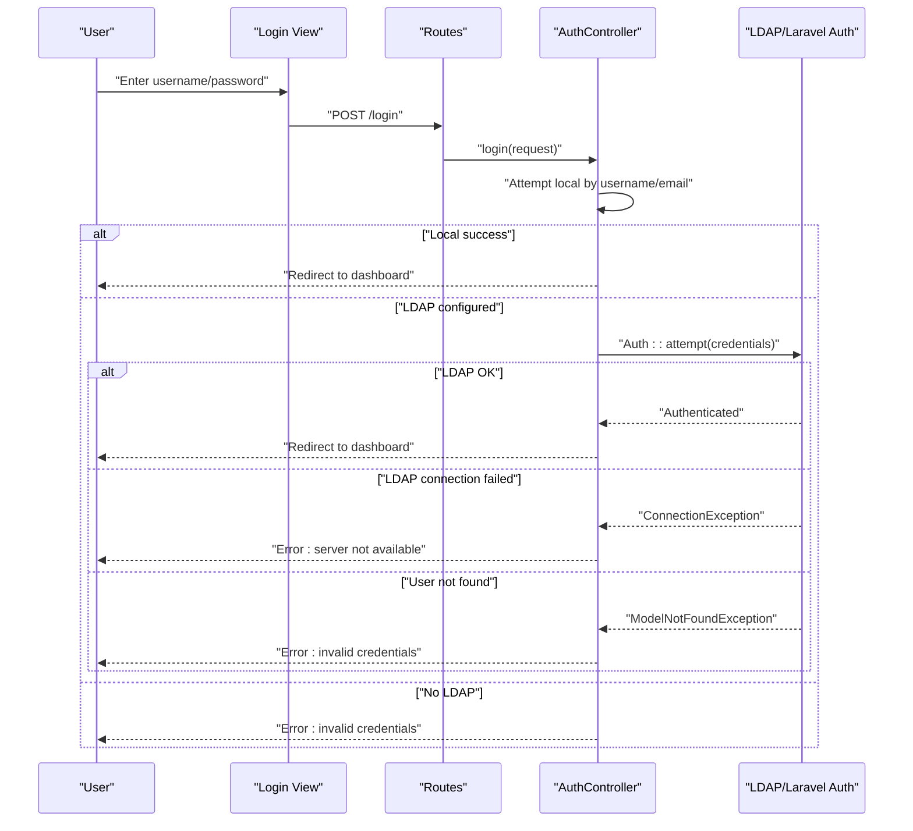
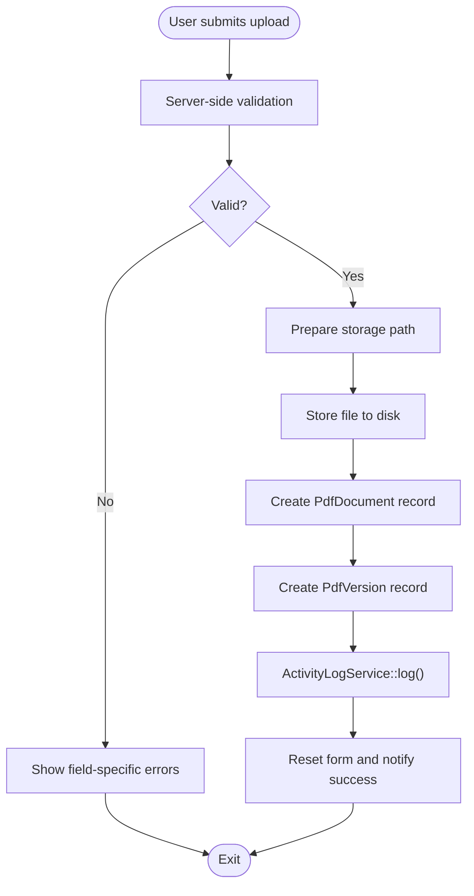
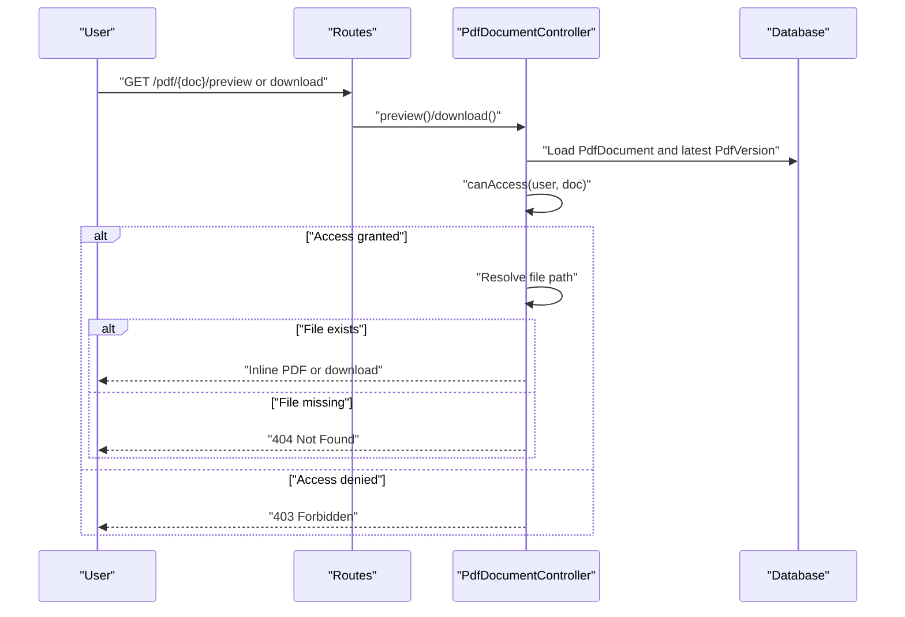
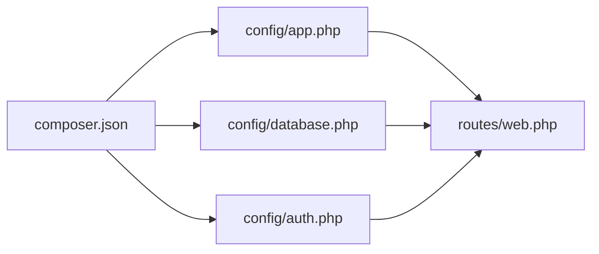

# Troubleshooting and FAQ

<cite>
**Referenced Files in This Document**
- [composer.json](file://composer.json)
- [config/app.php](file://config/app.php)
- [config/database.php](file://config/database.php)
- [config/auth.php](file://config/auth.php)
- [routes/web.php](file://routes/web.php)
- [app/Http/Controllers/AuthController.php](file://app/Http/Controllers/AuthController.php)
- [app/Http/Controllers/PdfDocumentController.php](file://app/Http/Controllers/PdfDocumentController.php)
- [app/Livewire/PdfUpload.php](file://app/Livewire/PdfUpload.php)
- [app/Livewire/Dashboard.php](file://app/Livewire/Dashboard.php)
- [app/Models/User.php](file://app/Models/User.php)
- [app/Models/PdfDocument.php](file://app/Models/PdfDocument.php)
- [app/Services/ActivityLogService.php](file://app/Services/ActivityLogService.php)
- [database/migrations/2024_06_10_120000_create_pdf_documents_table.php](file://database/migrations/2024_06_10_120000_create_pdf_documents_table.php)
- [database/migrations/2024_06_10_130000_create_pdf_versions_table.php](file://database/migrations/2024_06_10_130000_create_pdf_versions_table.php)
- [resources/views/auth/login.blade.php](file://resources/views/auth/login.blade.php)
- [resources/views/livewire/pdf-upload.blade.php](file://resources/views/livewire/pdf-upload.blade.php)
</cite>

## Table of Contents
1. Introduction
2. Project Structure
3. Core Components
4. Architecture Overview
5. Detailed Component Analysis
6. Dependency Analysis
7. Performance Considerations
8. Troubleshooting Guide
9. Conclusion
10. Appendices

## Introduction
This document provides comprehensive troubleshooting and FAQ guidance for the PDF correction system. It covers installation and environment setup, authentication failures, file upload errors, database connectivity and migrations, performance tuning, debugging strategies for Livewire components and backend services, browser and JavaScript-related issues, and escalation procedures for unresolved matters.

## Project Structure
The system is a Laravel application with Livewire components and Blade views. Authentication integrates both local accounts and LDAP. PDF lifecycle is handled by controllers and Livewire components, with Eloquent models and database migrations backing persistence.

**Diagram sources**
- [routes/web.php:1-54](file://routes/web.php#L1-L54)
- [resources/views/auth/login.blade.php:1-50](file://resources/views/auth/login.blade.php#L1-L50)
- [resources/views/livewire/pdf-upload.blade.php:1-142](file://resources/views/livewire/pdf-upload.blade.php#L1-L142)
- [app/Livewire/PdfUpload.php:1-96](file://app/Livewire/PdfUpload.php#L1-L96)
- [app/Livewire/Dashboard.php:1-92](file://app/Livewire/Dashboard.php#L1-L92)
- [app/Http/Controllers/AuthController.php:1-81](file://app/Http/Controllers/AuthController.php#L1-L81)
- [app/Http/Controllers/PdfDocumentController.php:1-82](file://app/Http/Controllers/PdfDocumentController.php#L1-L82)
- [app/Services/ActivityLogService.php:1-31](file://app/Services/ActivityLogService.php#L1-L31)
- [app/Models/User.php:1-71](file://app/Models/User.php#L1-L71)
- [app/Models/PdfDocument.php:1-130](file://app/Models/PdfDocument.php#L1-L130)
- [database/migrations/2024_06_10_120000_create_pdf_documents_table.php:1-32](file://database/migrations/2024_06_10_120000_create_pdf_documents_table.php#L1-L32)
- [database/migrations/2024_06_10_130000_create_pdf_versions_table.php:1-29](file://database/migrations/2024_06_10_130000_create_pdf_versions_table.php#L1-L29)

**Section sources**
- [routes/web.php:1-54](file://routes/web.php#L1-L54)
- [resources/views/auth/login.blade.php:1-50](file://resources/views/auth/login.blade.php#L1-L50)
- [resources/views/livewire/pdf-upload.blade.php:1-142](file://resources/views/livewire/pdf-upload.blade.php#L1-L142)
- [app/Livewire/PdfUpload.php:1-96](file://app/Livewire/PdfUpload.php#L1-L96)
- [app/Livewire/Dashboard.php:1-92](file://app/Livewire/Dashboard.php#L1-L92)
- [app/Http/Controllers/AuthController.php:1-81](file://app/Http/Controllers/AuthController.php#L1-L81)
- [app/Http/Controllers/PdfDocumentController.php:1-82](file://app/Http/Controllers/PdfDocumentController.php#L1-L82)
- [app/Services/ActivityLogService.php:1-31](file://app/Services/ActivityLogService.php#L1-L31)
- [app/Models/User.php:1-71](file://app/Models/User.php#L1-L71)
- [app/Models/PdfDocument.php:1-130](file://app/Models/PdfDocument.php#L1-L130)
- [database/migrations/2024_06_10_120000_create_pdf_documents_table.php:1-32](file://database/migrations/2024_06_10_120000_create_pdf_documents_table.php#L1-L32)
- [database/migrations/2024_06_10_130000_create_pdf_versions_table.php:1-29](file://database/migrations/2024_06_10_130000_create_pdf_versions_table.php#L1-L29)

## Core Components
- Authentication: Local and LDAP flows with explicit error handling and logging.
- PDF Upload: Livewire component with validation, temporary storage handling, and persistence.
- PDF Access: Controllers for preview and download with access checks and file existence verification.
- Models and Migrations: Typed attributes, foreign keys, enums, and unique constraints.
- Activity Logging: Centralized service for auditing actions.

Key implementation references:
- Authentication flow and LDAP error handling: [AuthController.php:21-71](file://app/Http/Controllers/AuthController.php#L21-L71)
- PDF upload validation and storage: [PdfUpload.php:27-87](file://app/Livewire/PdfUpload.php#L27-L87)
- Preview/download access checks and file existence: [PdfDocumentController.php:15-63](file://app/Http/Controllers/PdfDocumentController.php#L15-L63)
- Role-based access helpers: [User.php:56-69](file://app/Models/User.php#L56-L69)
- Status labels and scopes: [PdfDocument.php:14-129](file://app/Models/PdfDocument.php#L14-L129)

**Section sources**
- [app/Http/Controllers/AuthController.php:1-81](file://app/Http/Controllers/AuthController.php#L1-L81)
- [app/Livewire/PdfUpload.php:1-96](file://app/Livewire/PdfUpload.php#L1-L96)
- [app/Http/Controllers/PdfDocumentController.php:1-82](file://app/Http/Controllers/PdfDocumentController.php#L1-L82)
- [app/Models/User.php:1-71](file://app/Models/User.php#L1-L71)
- [app/Models/PdfDocument.php:1-130](file://app/Models/PdfDocument.php#L1-L130)

## Architecture Overview
High-level interactions among frontend, routing, controllers, Livewire components, and persistence.

**Diagram sources**
- [routes/web.php:21-41](file://routes/web.php#L21-L41)
- [app/Http/Controllers/AuthController.php:21-71](file://app/Http/Controllers/AuthController.php#L21-L71)
- [app/Http/Controllers/PdfDocumentController.php:15-63](file://app/Http/Controllers/PdfDocumentController.php#L15-L63)
- [app/Livewire/PdfUpload.php:47-87](file://app/Livewire/PdfUpload.php#L47-L87)

## Detailed Component Analysis

### Authentication Flow
Common issues:
- Wrong credentials
- LDAP server unreachable
- LDAP user not found

Diagnostic steps:
- Verify provider configuration and guard settings.
- Check logs for LDAP connection errors.
- Confirm user exists locally or in LDAP.

**Diagram sources**
- [routes/web.php:21-23](file://routes/web.php#L21-L23)
- [app/Http/Controllers/AuthController.php:21-71](file://app/Http/Controllers/AuthController.php#L21-L71)
- [resources/views/auth/login.blade.php:1-50](file://resources/views/auth/login.blade.php#L1-L50)
- [config/auth.php:1-49](file://config/auth.php#L1-L49)

**Section sources**
- [app/Http/Controllers/AuthController.php:21-71](file://app/Http/Controllers/AuthController.php#L21-L71)
- [config/auth.php:1-49](file://config/auth.php#L1-L49)
- [resources/views/auth/login.blade.php:1-50](file://resources/views/auth/login.blade.php#L1-L50)

### PDF Upload Component
Common issues:
- File type not PDF
- File too large
- Missing required fields
- Storage path resolution failure

Diagnostic steps:
- Validate client-side and server-side rules.
- Inspect Livewire upload events and Alpine handlers.
- Confirm storage disk configuration and folder permissions.

**Diagram sources**
- [app/Livewire/PdfUpload.php:27-87](file://app/Livewire/PdfUpload.php#L27-L87)
- [resources/views/livewire/pdf-upload.blade.php:1-142](file://resources/views/livewire/pdf-upload.blade.php#L1-L142)

**Section sources**
- [app/Livewire/PdfUpload.php:1-96](file://app/Livewire/PdfUpload.php#L1-L96)
- [resources/views/livewire/pdf-upload.blade.php:1-142](file://resources/views/livewire/pdf-upload.blade.php#L1-L142)

### PDF Preview and Download
Common issues:
- Access denied due to roles
- File not found on disk
- Missing latest version

Diagnostic steps:
- Verify user roles and ownership/assignment.
- Confirm file path construction and physical file presence.
- Ensure latest version exists and is loaded.

**Diagram sources**
- [routes/web.php:38-41](file://routes/web.php#L38-L41)
- [app/Http/Controllers/PdfDocumentController.php:15-63](file://app/Http/Controllers/PdfDocumentController.php#L15-L63)
- [app/Models/PdfDocument.php:61-70](file://app/Models/PdfDocument.php#L61-L70)

**Section sources**
- [app/Http/Controllers/PdfDocumentController.php:1-82](file://app/Http/Controllers/PdfDocumentController.php#L1-L82)
- [app/Models/PdfDocument.php:1-130](file://app/Models/PdfDocument.php#L1-L130)

## Dependency Analysis
- PHP and framework versions are defined in Composer.
- Application configuration includes debug flag, frontend URL, and maintenance driver.
- Database supports SQLite, MySQL, PostgreSQL, SQL Server with configurable credentials.
- Authentication guards and providers are configurable, including LDAP.
- Routes define middleware groups for roles and permissions.

**Diagram sources**
- [composer.json:1-70](file://composer.json#L1-L70)
- [config/app.php:1-92](file://config/app.php#L1-L92)
- [config/database.php:1-93](file://config/database.php#L1-L93)
- [config/auth.php:1-49](file://config/auth.php#L1-L49)
- [routes/web.php:1-54](file://routes/web.php#L1-L54)

**Section sources**
- [composer.json:1-70](file://composer.json#L1-L70)
- [config/app.php:1-92](file://config/app.php#L1-L92)
- [config/database.php:1-93](file://config/database.php#L1-L93)
- [config/auth.php:1-49](file://config/auth.php#L1-L49)
- [routes/web.php:1-54](file://routes/web.php#L1-L54)

## Performance Considerations
- Pagination: Dashboard uses pagination to limit result sets per page.
- Indexing and constraints: Foreign keys and unique constraints improve join performance and data integrity.
- File operations: Large PDF uploads increase I/O; consider optimizing storage and limiting max file size.
- Caching: Enable appropriate cache drivers and Redis configuration for session and cache stores.
- Debug mode: Keep debug off in production to reduce overhead.

[No sources needed since this section provides general guidance]

## Troubleshooting Guide

### Installation and Environment Setup
Symptoms:
- Composer install fails
- Application key missing
- Database connection errors during initial migration

Resolutions:
- Ensure PHP version matches the requirement.
- Run Composer install/update and generate application key.
- Configure environment variables for database connection and provider settings.
- Execute migrations and seeders as needed.

References:
- PHP and package requirements: [composer.json:7-14](file://composer.json#L7-L14)
- Scripts for key generation and migration: [composer.json:41-51](file://composer.json#L41-L51)
- Application configuration (debug, maintenance): [config/app.php:6-20](file://config/app.php#L6-L20)

**Section sources**
- [composer.json:7-14](file://composer.json#L7-L14)
- [composer.json:41-51](file://composer.json#L41-L51)
- [config/app.php:6-20](file://config/app.php#L6-L20)

### Authentication Failures
Symptoms:
- “Invalid credentials” messages
- LDAP server not available
- User not found in LDAP

Resolutions:
- Verify username/email and password.
- Check LDAP server availability and network connectivity.
- Confirm LDAP user synchronization and attributes mapping.
- Review authentication logs for detailed errors.

References:
- Login flow and error handling: [AuthController.php:21-71](file://app/Http/Controllers/AuthController.php#L21-L71)
- LDAP provider configuration: [config/auth.php:19-37](file://config/auth.php#L19-L37)
- Login view error rendering: [resources/views/auth/login.blade.php:13-21](file://resources/views/auth/login.blade.php#L13-L21)

**Section sources**
- [app/Http/Controllers/AuthController.php:21-71](file://app/Http/Controllers/AuthController.php#L21-L71)
- [config/auth.php:19-37](file://config/auth.php#L19-L37)
- [resources/views/auth/login.blade.php:13-21](file://resources/views/auth/login.blade.php#L13-L21)

### File Upload Errors
Symptoms:
- “Only PDF files are allowed”
- “File upload error”
- “Maximum file size exceeded”
- “Validation errors on fields”

Resolutions:
- Ensure only PDF files are selected/dragged.
- Check browser support for drag-and-drop and file uploads.
- Reduce file size below the configured maximum.
- Fill all required fields (title, name, deadline).
- Confirm storage disk is writable and path exists.

References:
- Validation rules and max size: [PdfUpload.php:27-34](file://app/Livewire/PdfUpload.php#L27-L34)
- Alpine.js drop zone handler and error alerts: [pdf-upload.blade.php:7-25](file://resources/views/livewire/pdf-upload.blade.php#L7-L25)
- Form submission and success notifications: [pdf-upload.blade.php:132-138](file://resources/views/livewire/pdf-upload.blade.php#L132-L138)

**Section sources**
- [app/Livewire/PdfUpload.php:27-34](file://app/Livewire/PdfUpload.php#L27-L34)
- [resources/views/livewire/pdf-upload.blade.php:7-25](file://resources/views/livewire/pdf-upload.blade.php#L7-L25)
- [resources/views/livewire/pdf-upload.blade.php:132-138](file://resources/views/livewire/pdf-upload.blade.php#L132-L138)

### PDF Preview/Download Issues
Symptoms:
- “Access denied” errors
- “File not found” errors
- Blank or broken PDF preview

Resolutions:
- Verify user role and ownership/assignment to the document.
- Confirm the file exists at the computed storage path.
- Ensure the latest version exists and is accessible.
- Check file permissions and storage disk configuration.

References:
- Access control logic: [PdfDocumentController.php:19-21](file://app/Http/Controllers/PdfDocumentController.php#L19-L21)
- File existence checks: [PdfDocumentController.php:33-37](file://app/Http/Controllers/PdfDocumentController.php#L33-L37)
- Preview response handling: [PdfDocumentController.php:59-62](file://app/Http/Controllers/PdfDocumentController.php#L59-L62)

**Section sources**
- [app/Http/Controllers/PdfDocumentController.php:19-21](file://app/Http/Controllers/PdfDocumentController.php#L19-L21)
- [app/Http/Controllers/PdfDocumentController.php:33-37](file://app/Http/Controllers/PdfDocumentController.php#L33-L37)
- [app/Http/Controllers/PdfDocumentController.php:59-62](file://app/Http/Controllers/PdfDocumentController.php#L59-L62)

### Database Connectivity and Migrations
Symptoms:
- Database connection refused
- Migration errors
- Unknown column or table issues

Resolutions:
- Verify database credentials and connection string.
- Run migrations and ensure they complete successfully.
- Check foreign key constraints and unique indexes.
- Confirm database engine and charset compatibility.

References:
- Database connections and Redis: [config/database.php:5-92](file://config/database.php#L5-L92)
- PDF documents table (foreign keys, enums): [create_pdf_documents_table.php:11-24](file://database/migrations/2024_06_10_120000_create_pdf_documents_table.php#L11-L24)
- PDF versions table (unique composite index): [create_pdf_versions_table.php:11-21](file://database/migrations/2024_06_10_130000_create_pdf_versions_table.php#L11-L21)

**Section sources**
- [config/database.php:5-92](file://config/database.php#L5-L92)
- [database/migrations/2024_06_10_120000_create_pdf_documents_table.php:11-24](file://database/migrations/2024_06_10_120000_create_pdf_documents_table.php#L11-L24)
- [database/migrations/2024_06_10_130000_create_pdf_versions_table.php:11-21](file://database/migrations/2024_06_10_130000_create_pdf_versions_table.php#L11-L21)

### Performance Troubleshooting (Slow Queries and Memory)
Symptoms:
- Slow page loads
- High memory usage
- Long-running operations

Resolutions:
- Enable query logging and review slow queries.
- Add indexes on frequently filtered columns (e.g., status, title_id, uploaded_by_user_id).
- Optimize pagination and limit joins.
- Monitor memory usage and adjust PHP memory limits if needed.
- Use caching for static lists (e.g., titles).

References:
- Dashboard pagination and filtering: [Dashboard.php:14-76](file://app/Livewire/Dashboard.php#L14-L76)
- PDF documents model scopes and relations: [PdfDocument.php:72-96](file://app/Models/PdfDocument.php#L72-L96)

**Section sources**
- [app/Livewire/Dashboard.php:14-76](file://app/Livewire/Dashboard.php#L14-L76)
- [app/Models/PdfDocument.php:72-96](file://app/Models/PdfDocument.php#L72-L96)

### Debugging Livewire Components and Backend Services
Symptoms:
- Livewire events not firing
- Component state not updating
- Backend exceptions not visible

Resolutions:
- Use browser dev tools to inspect Livewire events and Alpine.js interactions.
- Add logging around Livewire handlers and controller actions.
- Enable application debug mode temporarily for detailed stack traces.
- Validate CSRF tokens and form submissions.

References:
- Livewire upload handler and dispatch events: [PdfUpload.php:40-44](file://app/Livewire/PdfUpload.php#L40-L44)
- Alpine.js drop zone and upload callbacks: [pdf-upload.blade.php:7-25](file://resources/views/livewire/pdf-upload.blade.php#L7-L25)
- Activity logging for auditable actions: [ActivityLogService.php:20-29](file://app/Services/ActivityLogService.php#L20-L29)

**Section sources**
- [app/Livewire/PdfUpload.php:40-44](file://app/Livewire/PdfUpload.php#L40-L44)
- [resources/views/livewire/pdf-upload.blade.php:7-25](file://resources/views/livewire/pdf-upload.blade.php#L7-L25)
- [app/Services/ActivityLogService.php:20-29](file://app/Services/ActivityLogService.php#L20-L29)

### Browser Compatibility and JavaScript Issues
Symptoms:
- Drag-and-drop does not work
- PDF preview opens externally
- Forms not submitting

Resolutions:
- Test with supported browsers and enable JavaScript.
- Ensure Alpine.js and Livewire scripts are loaded.
- Verify Content-Disposition header for inline previews.
- Check CSP policies and MIME types.

References:
- Inline preview response headers: [PdfDocumentController.php:59-62](file://app/Http/Controllers/PdfDocumentController.php#L59-L62)
- Drop zone and Alpine integration: [pdf-upload.blade.php:7-31](file://resources/views/livewire/pdf-upload.blade.php#L7-L31)

**Section sources**
- [app/Http/Controllers/PdfDocumentController.php:59-62](file://app/Http/Controllers/PdfDocumentController.php#L59-L62)
- [resources/views/livewire/pdf-upload.blade.php:7-31](file://resources/views/livewire/pdf-upload.blade.php#L7-L31)

### Frequently Asked Questions
- What file types are supported?
  - Only PDF files are accepted.
- What is the maximum file size?
  - Maximum size is configured in the upload component.
- How are access rights enforced?
  - Access depends on roles and ownership/assignment.
- How are versions managed?
  - Each upload creates a new version with a unique number.
- How are activities tracked?
  - All major actions are logged with user, IP, and details.

References:
- Validation rules and max size: [PdfUpload.php:27-34](file://app/Livewire/PdfUpload.php#L27-L34)
- Access control: [PdfDocumentController.php:65-80](file://app/Http/Controllers/PdfDocumentController.php#L65-L80)
- Version creation: [PdfUpload.php:74-80](file://app/Livewire/PdfUpload.php#L74-L80)
- Activity logging constants: [ActivityLogService.php:12-18](file://app/Services/ActivityLogService.php#L12-L18)

**Section sources**
- [app/Livewire/PdfUpload.php:27-34](file://app/Livewire/PdfUpload.php#L27-L34)
- [app/Http/Controllers/PdfDocumentController.php:65-80](file://app/Http/Controllers/PdfDocumentController.php#L65-L80)
- [app/Livewire/PdfUpload.php:74-80](file://app/Livewire/PdfUpload.php#L74-L80)
- [app/Services/ActivityLogService.php:12-18](file://app/Services/ActivityLogService.php#L12-L18)

### Escalation Procedures
When issues persist:
- Collect logs from application and web server.
- Capture browser console and network tab output.
- Provide environment details (PHP version, database type, OS).
- Include reproduction steps and screenshots.
- Open a ticket with the collected diagnostics for deeper investigation.

[No sources needed since this section summarizes without analyzing specific files]

## Conclusion
This guide consolidates actionable troubleshooting steps for installation, authentication, uploads, downloads, database connectivity, performance, and debugging. Use the referenced files and sections to quickly diagnose and resolve most issues. For persistent problems, escalate with comprehensive diagnostics and environment details.

[No sources needed since this section summarizes without analyzing specific files]

## Appendices

### Quick Reference: Common Error Messages and Causes
- “LDAP server not accessible”: Network or LDAP configuration issue.
- “Invalid credentials”: Incorrect username/password or LDAP user not found.
- “Only PDF files are allowed”: Non-PDF selected/dropped.
- “Maximum file size exceeded”: File larger than configured limit.
- “Access denied”: User lacks required role or ownership/assignment.
- “File not found”: Stored file missing or path incorrect.

**Section sources**
- [app/Http/Controllers/AuthController.php:58-65](file://app/Http/Controllers/AuthController.php#L58-L65)
- [resources/views/auth/login.blade.php:13-21](file://resources/views/auth/login.blade.php#L13-L21)
- [resources/views/livewire/pdf-upload.blade.php:21-23](file://resources/views/livewire/pdf-upload.blade.php#L21-L23)
- [app/Livewire/PdfUpload.php:28-34](file://app/Livewire/PdfUpload.php#L28-L34)
- [app/Http/Controllers/PdfDocumentController.php:19-21](file://app/Http/Controllers/PdfDocumentController.php#L19-L21)
- [app/Http/Controllers/PdfDocumentController.php:35-37](file://app/Http/Controllers/PdfDocumentController.php#L35-L37)