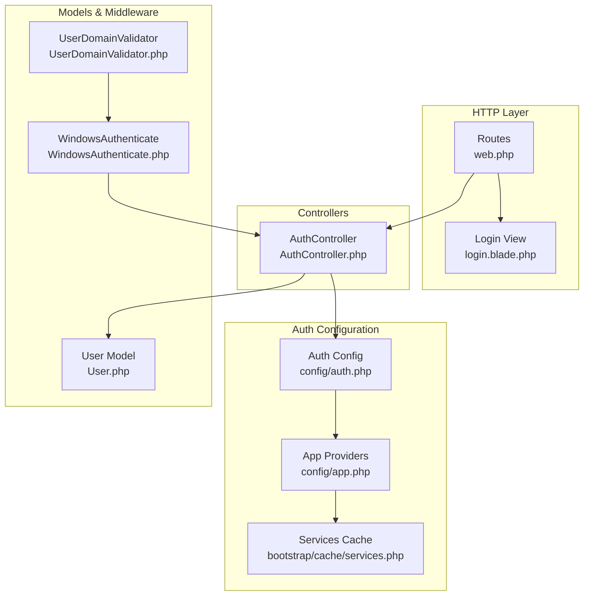
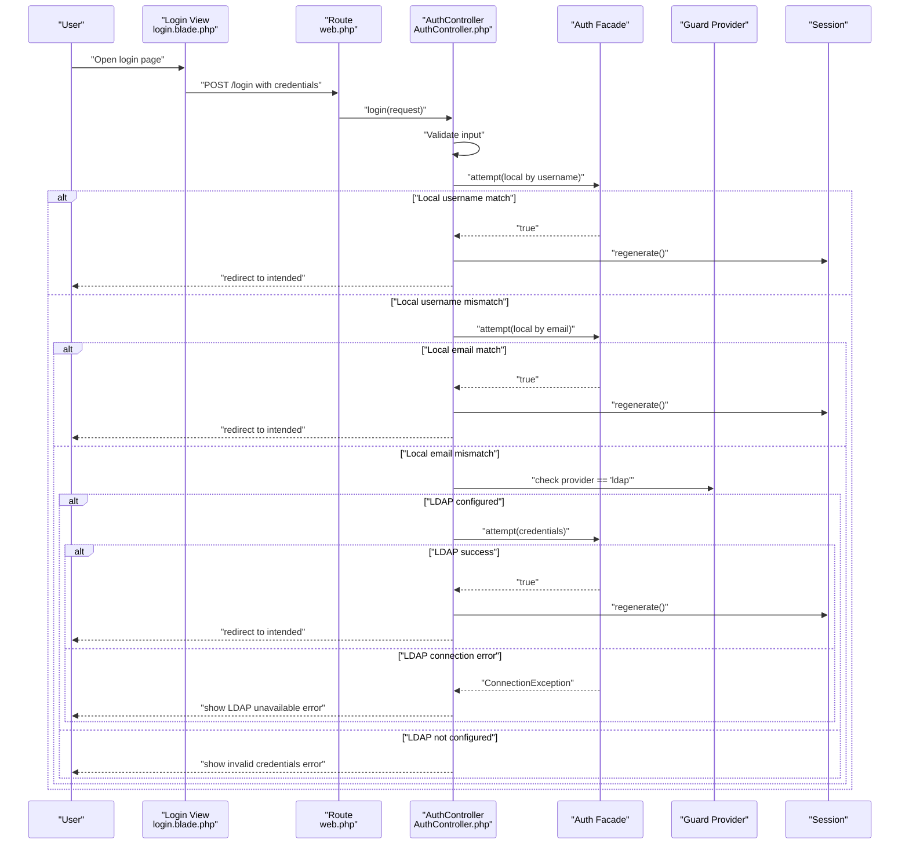
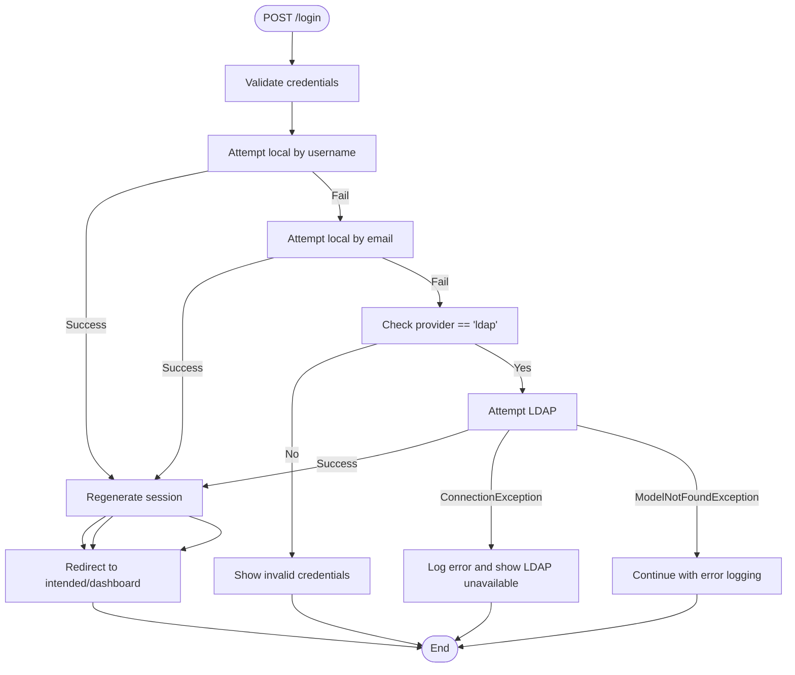
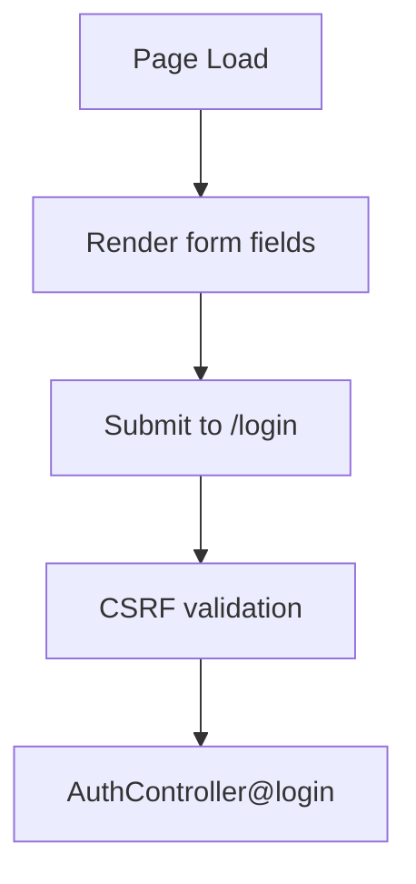
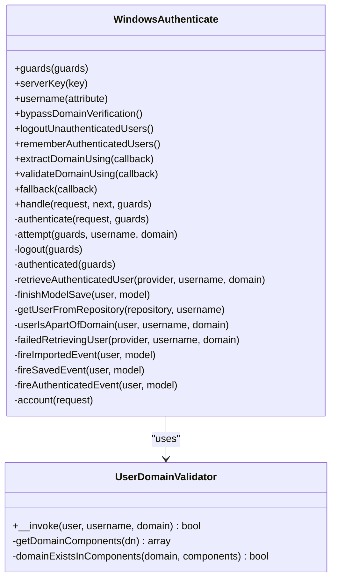
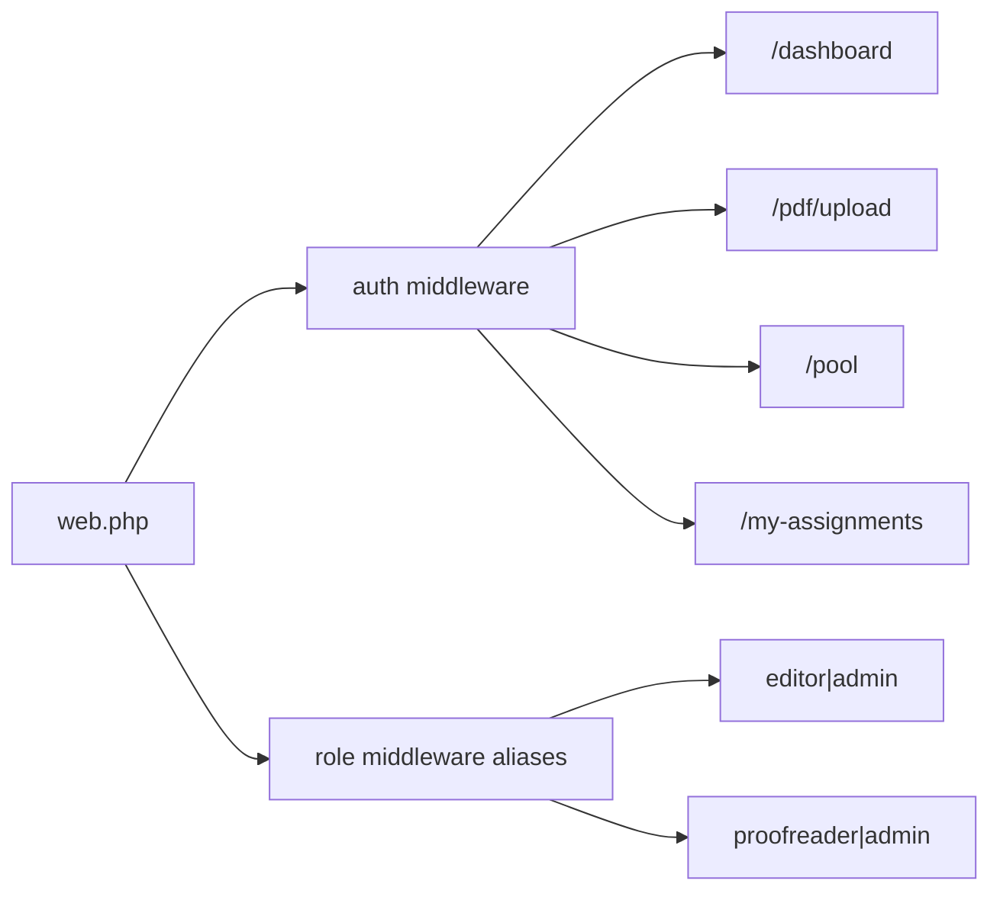
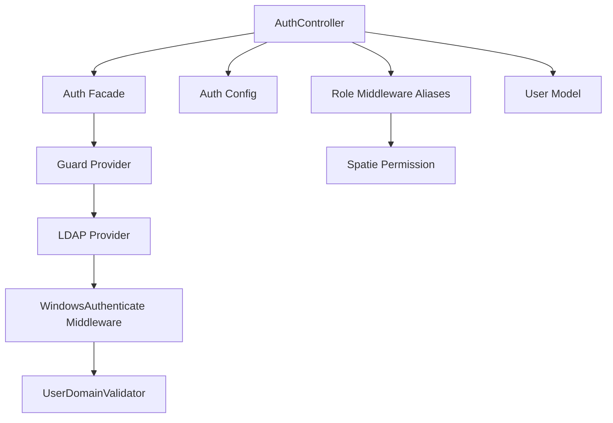

# Authentication System

<cite>
**Referenced Files in This Document**
- [AuthController.php](file://app/Http/Controllers/AuthController.php)
- [auth.php](file://config/auth.php)
- [login.blade.php](file://resources/views/auth/login.blade.php)
- [web.php](file://routes/web.php)
- [User.php](file://app/Models/User.php)
- [app.php](file://bootstrap/app.php)
- [app.php](file://config/app.php)
- [services.php](file://bootstrap/cache/services.php)
- [WindowsAuthenticate.php](file://vendor/directorytree/ldaprecord-laravel/src/Middleware/WindowsAuthenticate.php)
- [UserDomainValidator.php](file://vendor/directorytree/ldaprecord-laravel/src/Middleware/UserDomainValidator.php)
</cite>

## Table of Contents
1. [Introduction](#introduction)
2. [Project Structure](#project-structure)
3. [Core Components](#core-components)
4. [Architecture Overview](#architecture-overview)
5. [Detailed Component Analysis](#detailed-component-analysis)
6. [Dependency Analysis](#dependency-analysis)
7. [Performance Considerations](#performance-considerations)
8. [Troubleshooting Guide](#troubleshooting-guide)
9. [Conclusion](#conclusion)

## Introduction
This document describes the authentication system for the PDF correction platform. It covers multi-factor authentication approaches supporting local accounts, email-based login, and LDAP/Active Directory integration. It explains the login flow, credential validation, session management, automatic redirection patterns, LDAP connection handling with error management, password-based authentication, and remember me functionality. Security considerations for credential handling and session regeneration are included, along with examples of login form implementation and authentication middleware usage. Common authentication issues and LDAP configuration requirements are addressed for troubleshooting.

## Project Structure
The authentication system spans several key areas:
- Routes define login/logout endpoints and apply the auth middleware to protected pages.
- The AuthController handles login attempts, session regeneration, and logout.
- Blade templates render the login form with CSRF protection and remember me support.
- Configuration files define guards/providers for local and LDAP authentication.
- Middleware integrates with LdapRecord for Windows Single Sign-On (SSO) scenarios.
- The User model manages roles and permissions via Spatie Permission package.

**Diagram sources**
- [web.php:21-23](file://routes/web.php#L21-L23)
- [login.blade.php:23](file://resources/views/auth/login.blade.php#L23)
- [AuthController.php:21-71](file://app/Http/Controllers/AuthController.php#L21-L71)
- [auth.php:8-38](file://config/auth.php#L8-L38)
- [app.php:44](file://config/app.php#L44)
- [services.php:26-27](file://bootstrap/cache/services.php#L26-L27)
- [User.php:10-70](file://app/Models/User.php#L10-L70)
- [WindowsAuthenticate.php:22-406](file://vendor/directorytree/ldaprecord-laravel/src/Middleware/WindowsAuthenticate.php#L22-L406)
- [UserDomainValidator.php:8-46](file://vendor/directorytree/ldaprecord-laravel/src/Middleware/UserDomainValidator.php#L8-L46)

**Section sources**
- [web.php:21-23](file://routes/web.php#L21-L23)
- [login.blade.php:23](file://resources/views/auth/login.blade.php#L23)
- [AuthController.php:21-71](file://app/Http/Controllers/AuthController.php#L21-L71)
- [auth.php:8-38](file://config/auth.php#L8-L38)
- [app.php:44](file://config/app.php#L44)
- [services.php:26-27](file://bootstrap/cache/services.php#L26-L27)
- [User.php:10-70](file://app/Models/User.php#L10-L70)
- [WindowsAuthenticate.php:22-406](file://vendor/directorytree/ldaprecord-laravel/src/Middleware/WindowsAuthenticate.php#L22-L406)
- [UserDomainValidator.php:8-46](file://vendor/directorytree/ldaprecord-laravel/src/Middleware/UserDomainValidator.php#L8-L46)

## Core Components
- Login Form: Renders username/email, password, and remember me checkbox; posts to the login endpoint with CSRF protection.
- AuthController: Validates credentials, tries local username and email matches, then attempts LDAP if configured, manages sessions, and redirects to intended destination.
- Auth Configuration: Defines guards and providers for session-based local auth and LDAP-based auth with Active Directory model and database synchronization.
- Middleware: Integrates LdapRecord Windows SSO middleware for domain validation and user retrieval.
- User Model: Provides roles/permissions and hidden sensitive fields.

Key implementation references:
- Login form submission and CSRF token: [login.blade.php:23](file://resources/views/auth/login.blade.php#L23)
- Local and LDAP login attempts: [AuthController.php:31-66](file://app/Http/Controllers/AuthController.php#L31-L66)
- Session regeneration after successful login: [AuthController.php:37](file://app/Http/Controllers/AuthController.php#L37)
- Logout and token regeneration: [AuthController.php:73-79](file://app/Http/Controllers/AuthController.php#L73-L79)
- Guard/provider configuration: [auth.php:8-38](file://config/auth.php#L8-L38)
- Role middleware alias registration: [app.php:14-18](file://bootstrap/app.php#L14-L18)

**Section sources**
- [login.blade.php:23](file://resources/views/auth/login.blade.php#L23)
- [AuthController.php:31-66](file://app/Http/Controllers/AuthController.php#L31-L66)
- [AuthController.php:37](file://app/Http/Controllers/AuthController.php#L37)
- [AuthController.php:73-79](file://app/Http/Controllers/AuthController.php#L73-L79)
- [auth.php:8-38](file://config/auth.php#L8-L38)
- [app.php:14-18](file://bootstrap/app.php#L14-L18)

## Architecture Overview
The authentication architecture combines local and LDAP authentication under a unified guard. The flow validates credentials locally first, then falls back to LDAP when configured. Sessions are managed centrally, and protected routes enforce authentication and role-based access.

**Diagram sources**
- [login.blade.php:23](file://resources/views/auth/login.blade.php#L23)
- [web.php:21-23](file://routes/web.php#L21-L23)
- [AuthController.php:21-71](file://app/Http/Controllers/AuthController.php#L21-L71)
- [auth.php:28](file://config/auth.php#L28)

**Section sources**
- [login.blade.php:23](file://resources/views/auth/login.blade.php#L23)
- [web.php:21-23](file://routes/web.php#L21-L23)
- [AuthController.php:21-71](file://app/Http/Controllers/AuthController.php#L21-L71)
- [auth.php:28](file://config/auth.php#L28)

## Detailed Component Analysis

### AuthController: Login Flow and Session Management
Responsibilities:
- Render login page if not authenticated.
- Validate credentials and attempt authentication in order: local username, local email, LDAP (if configured).
- Regenerate session on successful login to prevent session fixation.
- Redirect to intended destination or dashboard.
- Handle LDAP connection exceptions and user-not-found scenarios.
- Logout with session invalidation and CSRF token regeneration.

**Diagram sources**
- [AuthController.php:21-71](file://app/Http/Controllers/AuthController.php#L21-L71)

**Section sources**
- [AuthController.php:13-19](file://app/Http/Controllers/AuthController.php#L13-L19)
- [AuthController.php:21-71](file://app/Http/Controllers/AuthController.php#L21-L71)

### Login Form Implementation
The login view provides:
- CSRF protection via hidden token.
- Username/email field accepting either AD samAccountName or local email/username.
- Password field.
- Remember me checkbox mapped to the request's boolean flag.
- Submission to the login POST route.

**Diagram sources**
- [login.blade.php:23-46](file://resources/views/auth/login.blade.php#L23-L46)

**Section sources**
- [login.blade.php:23-46](file://resources/views/auth/login.blade.php#L23-L46)

### LDAP Integration and Windows SSO Middleware
The system integrates with LdapRecord for LDAP/AD authentication and Windows SSO:
- Guard/provider configuration enables LDAP driver with Active Directory model and database synchronization.
- WindowsAuthenticate middleware supports extracting username/domain, validating domain membership, retrieving users from LDAP, and synchronizing database models when configured.
- UserDomainValidator checks domain components in the distinguished name.

**Diagram sources**
- [WindowsAuthenticate.php:22-406](file://vendor/directorytree/ldaprecord-laravel/src/Middleware/WindowsAuthenticate.php#L22-L406)
- [UserDomainValidator.php:8-46](file://vendor/directorytree/ldaprecord-laravel/src/Middleware/UserDomainValidator.php#L8-L46)

**Section sources**
- [auth.php:19-37](file://config/auth.php#L19-L37)
- [WindowsAuthenticate.php:22-406](file://vendor/directorytree/ldaprecord-laravel/src/Middleware/WindowsAuthenticate.php#L22-L406)
- [UserDomainValidator.php:8-46](file://vendor/directorytree/ldaprecord-laravel/src/Middleware/UserDomainValidator.php#L8-L46)

### Protected Routes and Role-Based Access
Protected routes require authentication and optionally roles:
- Authentication enforced via the auth middleware group.
- Role middleware aliases registered for editor/admin and proofreader/admin access.
- Dashboard and feature routes gated by role middleware.

**Diagram sources**
- [web.php:25-53](file://routes/web.php#L25-L53)
- [app.php:14-18](file://bootstrap/app.php#L14-L18)

**Section sources**
- [web.php:25-53](file://routes/web.php#L25-L53)
- [app.php:14-18](file://bootstrap/app.php#L14-L18)

## Dependency Analysis
The authentication stack relies on:
- Laravel’s built-in Auth facade and session management.
- LdapRecord-Laravel service providers enabling LDAP authentication and SSO.
- Spatie Permission middleware for role-based access control.
- Eloquent model for user data and password hashing.

**Diagram sources**
- [AuthController.php:21-71](file://app/Http/Controllers/AuthController.php#L21-L71)
- [auth.php:8-38](file://config/auth.php#L8-L38)
- [services.php:26-27](file://bootstrap/cache/services.php#L26-L27)
- [WindowsAuthenticate.php:22-406](file://vendor/directorytree/ldaprecord-laravel/src/Middleware/WindowsAuthenticate.php#L22-L406)
- [UserDomainValidator.php:8-46](file://vendor/directorytree/ldaprecord-laravel/src/Middleware/UserDomainValidator.php#L8-L46)
- [app.php:14-18](file://bootstrap/app.php#L14-L18)
- [User.php:10-70](file://app/Models/User.php#L10-L70)

**Section sources**
- [AuthController.php:21-71](file://app/Http/Controllers/AuthController.php#L21-L71)
- [auth.php:8-38](file://config/auth.php#L8-L38)
- [services.php:26-27](file://bootstrap/cache/services.php#L26-L27)
- [WindowsAuthenticate.php:22-406](file://vendor/directorytree/ldaprecord-laravel/src/Middleware/WindowsAuthenticate.php#L22-L406)
- [UserDomainValidator.php:8-46](file://vendor/directorytree/ldaprecord-laravel/src/Middleware/UserDomainValidator.php#L8-L46)
- [app.php:14-18](file://bootstrap/app.php#L14-L18)
- [User.php:10-70](file://app/Models/User.php#L10-L70)

## Performance Considerations
- Prefer local authentication first to avoid unnecessary LDAP queries when credentials match local users.
- Use session regeneration after login to mitigate session fixation risks.
- Keep LDAP provider configuration minimal (rules/scopes) to reduce overhead.
- Monitor LDAP connection errors and consider retry/backoff strategies at the infrastructure level.
- Ensure database synchronization settings are tuned to avoid excessive writes during user import.

## Troubleshooting Guide
Common authentication issues and resolutions:
- Invalid credentials:
  - Symptom: Error message indicating incorrect credentials.
  - Cause: Incorrect username/email or password.
  - Resolution: Verify input and ensure local account exists or LDAP is reachable.
  - Reference: [AuthController.php:68-70](file://app/Http/Controllers/AuthController.php#L68-L70)
- LDAP server unavailable:
  - Symptom: Error indicating LDAP server is not available.
  - Cause: Network connectivity or LDAP service downtime.
  - Resolution: Check LDAP server status, network connectivity, and logs.
  - Reference: [AuthController.php:58-62](file://app/Http/Controllers/AuthController.php#L58-L62)
- LDAP user not found:
  - Symptom: Warning logged for user not found; login continues.
  - Cause: Username not present in LDAP directory.
  - Resolution: Confirm user exists in AD/OU and search base configuration.
  - Reference: [AuthController.php:63-65](file://app/Http/Controllers/AuthController.php#L63-L65)
- Remember me not persisting:
  - Symptom: Session ends after browser restart.
  - Cause: Remember me checkbox not selected or session lifetime misconfiguration.
  - Resolution: Ensure checkbox is checked; verify session and cookie configuration.
  - Reference: [login.blade.php:38-41](file://resources/views/auth/login.blade.php#L38-L41)
- Role-based access denied:
  - Symptom: Redirect to login or insufficient permissions.
  - Cause: Missing required roles for the requested route.
  - Resolution: Assign appropriate roles to the user.
  - Reference: [web.php:28-36](file://routes/web.php#L28-L36), [app.php:14-18](file://bootstrap/app.php#L14-L18)
- Windows SSO domain mismatch:
  - Symptom: SSO login fails despite valid credentials.
  - Cause: Domain validation rejects the user based on distinguished name.
  - Resolution: Configure domain extraction/validation or bypass domain verification if appropriate.
  - Reference: [WindowsAuthenticate.php:349-358](file://vendor/directorytree/ldaprecord-laravel/src/Middleware/WindowsAuthenticate.php#L349-L358), [UserDomainValidator.php:13-44](file://vendor/directorytree/ldaprecord-laravel/src/Middleware/UserDomainValidator.php#L13-L44)

**Section sources**
- [AuthController.php:58-70](file://app/Http/Controllers/AuthController.php#L58-L70)
- [login.blade.php:38-41](file://resources/views/auth/login.blade.php#L38-L41)
- [web.php:28-36](file://routes/web.php#L28-L36)
- [app.php:14-18](file://bootstrap/app.php#L14-L18)
- [WindowsAuthenticate.php:349-358](file://vendor/directorytree/ldaprecord-laravel/src/Middleware/WindowsAuthenticate.php#L349-L358)
- [UserDomainValidator.php:13-44](file://vendor/directorytree/ldaprecord-laravel/src/Middleware/UserDomainValidator.php#L13-L44)

## Conclusion
The authentication system provides a robust, layered approach supporting local and LDAP/AD identities with secure session management and role-based access control. The AuthController orchestrates credential validation and redirection, while configuration and middleware enable flexible LDAP integration and SSO capabilities. Following the security and troubleshooting guidance ensures reliable operation across environments.