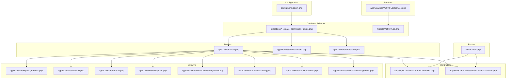
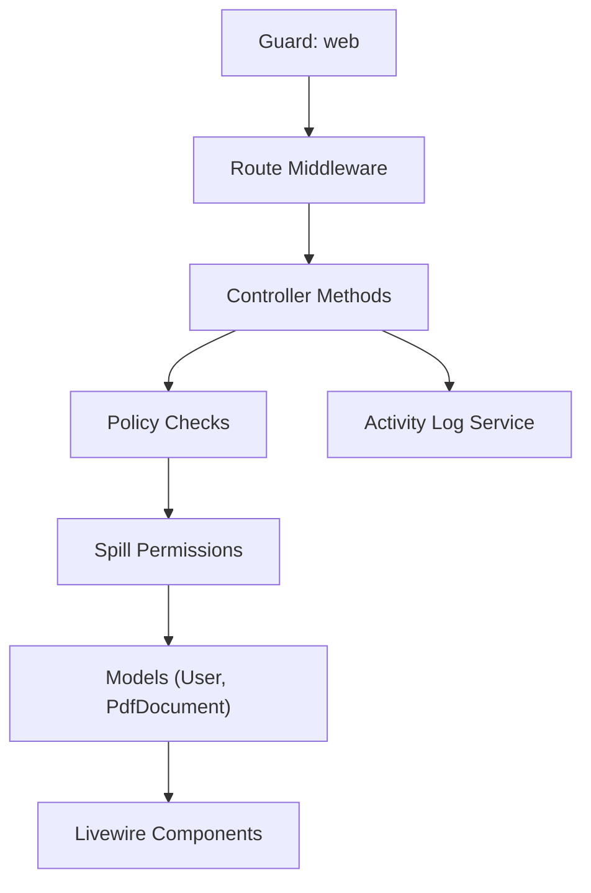
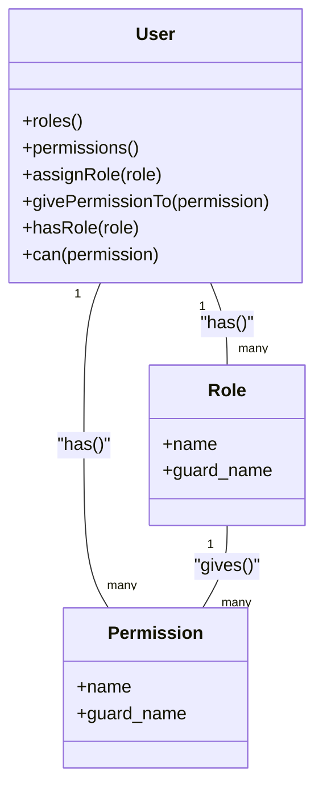
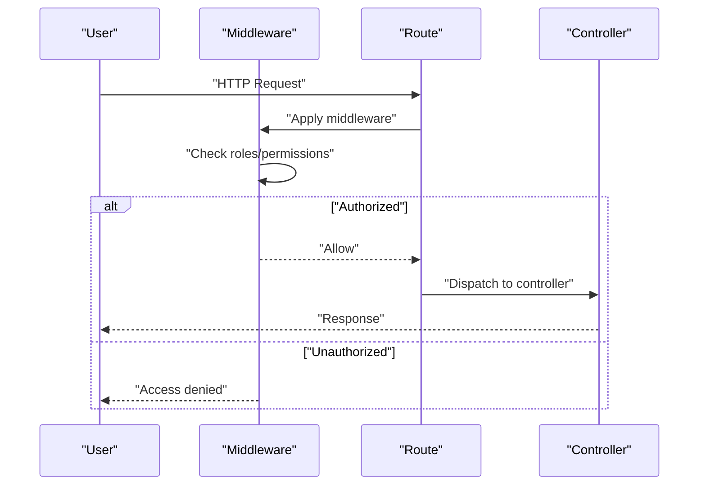
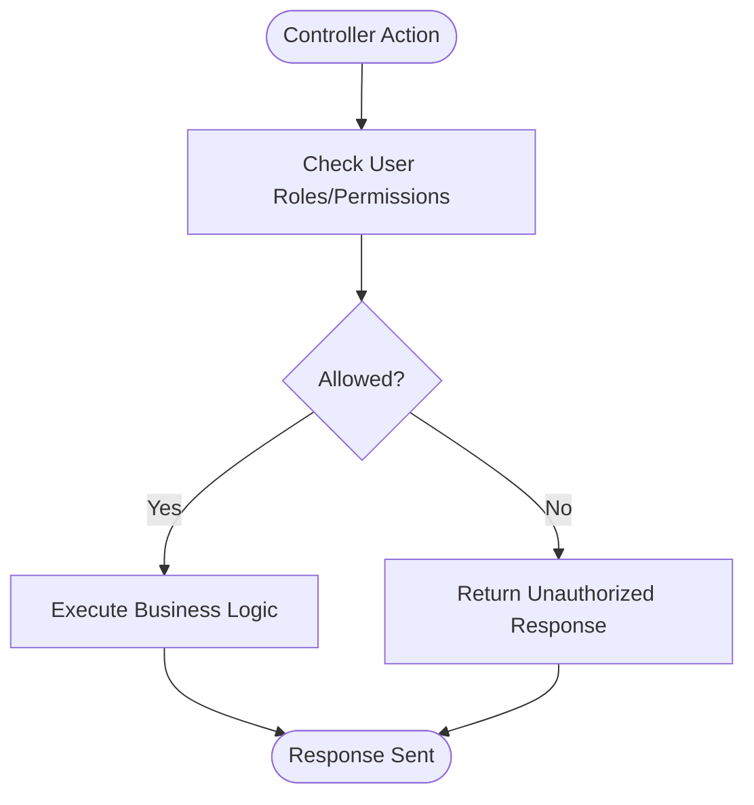
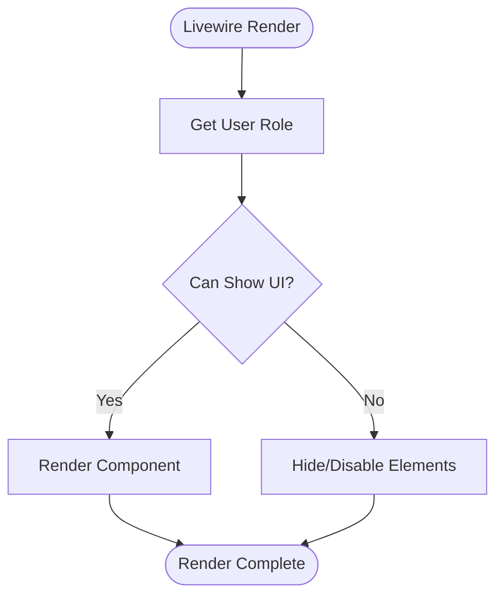
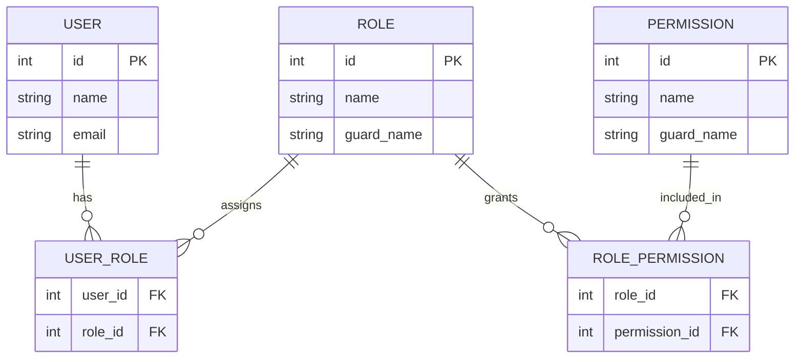
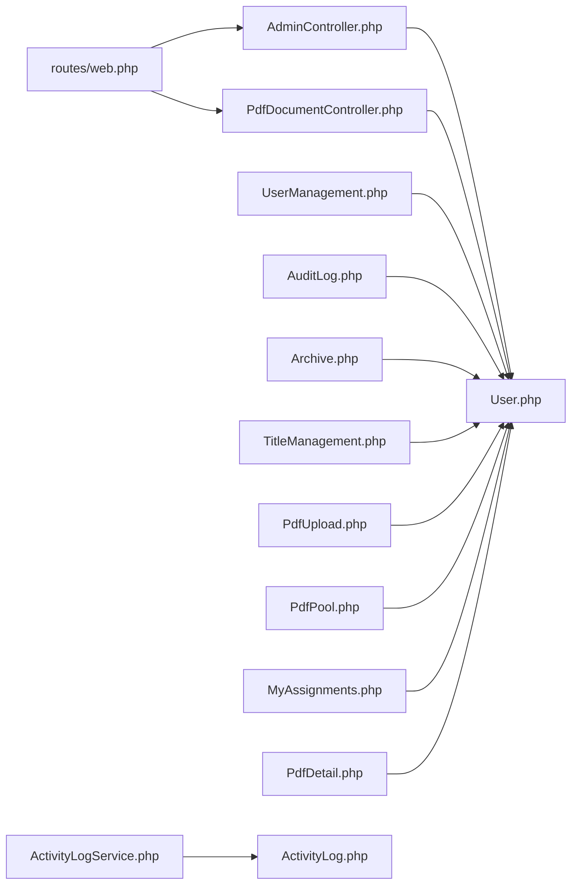

# Role-Based Access Control

<cite>
**Referenced Files in This Document**
- [permission.php](file://pdf-korektura/config/permission.php)
- [2024_06_10_100000_create_permission_tables.php](file://pdf-korektura/database/migrations/2024_06_10_100000_create_permission_tables.php)
- [User.php](file://pdf-korektura/app/Models/User.php)
- [PdfDocument.php](file://pdf-korektura/app/Models/PdfDocument.php)
- [PdfVersion.php](file://pdf-korektura/app/Models/PdfVersion.php)
- [AdminController.php](file://pdf-korektura/app/Http/Controllers/AdminController.php)
- [PdfDocumentController.php](file://pdf-korektura/app/Http/Controllers/PdfDocumentController.php)
- [web.php](file://pdf-korektura/routes/web.php)
- [AppServiceProvider.php](file://pdf-korektura/app/Providers/AppServiceProvider.php)
- [ActivityLog.php](file://pdf-korektura/app/Models/ActivityLog.php)
- [ActivityLogService.php](file://pdf-korektura/app/Services/ActivityLogService.php)
- [MyAssignments.php](file://pdf-korektura/app/Livewire/MyAssignments.php)
- [PdfDetail.php](file://pdf-korektura/app/Livewire/PdfDetail.php)
- [PdfPool.php](file://pdf-korektura/app/Livewire/PdfPool.php)
- [PdfUpload.php](file://pdf-korektura/app/Livewire/PdfUpload.php)
- [UserManagement.php](file://pdf-korektura/app/Livewire/Admin/UserManagement.php)
- [AuditLog.php](file://pdf-korektura/app/Livewire/Admin/AuditLog.php)
- [Archive.php](file://pdf-korektura/app/Livewire/Admin/Archive.php)
- [TitleManagement.php](file://pdf-korektura/app/Livewire/Admin/TitleManagement.php)
</cite>

## Table of Contents
1. [Introduction](#introduction)
2. [Project Structure](#project-structure)
3. [Core Components](#core-components)
4. [Architecture Overview](#architecture-overview)
5. [Detailed Component Analysis](#detailed-component-analysis)
6. [Dependency Analysis](#dependency-analysis)
7. [Performance Considerations](#performance-considerations)
8. [Troubleshooting Guide](#troubleshooting-guide)
9. [Conclusion](#conclusion)

## Introduction
This document provides comprehensive Role-Based Access Control (RBAC) documentation for the PDF correction system. It explains the three-tier role hierarchy, Spatie Laravel Permission integration, permission matrices, route protection, controller authorization, and dynamic permission assignment. It also clarifies the relationship between roles, permissions, and user profiles, along with troubleshooting guidance for access issues.

## Project Structure
The RBAC implementation centers around Spatie Laravel Permission’s database schema and model integrations, with controllers and Livewire components enforcing authorization policies. Key areas:
- Configuration: Spatie permission settings
- Migrations: Permission tables creation
- Models: User and document models with Spatie traits
- Controllers: Route handlers with authorization checks
- Routes: Middleware-protected endpoints
- Livewire: UI components with role-aware visibility and actions
- Services: Activity logging for audit trails

**Diagram sources**
- [permission.php](file://pdf-korektura/config/permission.php)
- [2024_06_10_100000_create_permission_tables.php](file://pdf-korektura/database/migrations/2024_06_10_100000_create_permission_tables.php)
- [User.php](file://pdf-korektura/app/Models/User.php)
- [PdfDocument.php](file://pdf-korektura/app/Models/PdfDocument.php)
- [PdfVersion.php](file://pdf-korektura/app/Models/PdfVersion.php)
- [AdminController.php](file://pdf-korektura/app/Http/Controllers/AdminController.php)
- [PdfDocumentController.php](file://pdf-korektura/app/Http/Controllers/PdfDocumentController.php)
- [web.php](file://pdf-korektura/routes/web.php)
- [ActivityLog.php](file://pdf-korektura/app/Models/ActivityLog.php)
- [ActivityLogService.php](file://pdf-korektura/app/Services/ActivityLogService.php)
- [MyAssignments.php](file://pdf-korektura/app/Livewire/MyAssignments.php)
- [PdfDetail.php](file://pdf-korektura/app/Livewire/PdfDetail.php)
- [PdfPool.php](file://pdf-korektura/app/Livewire/PdfPool.php)
- [PdfUpload.php](file://pdf-korektura/app/Livewire/PdfUpload.php)
- [UserManagement.php](file://pdf-korektura/app/Livewire/Admin/UserManagement.php)
- [AuditLog.php](file://pdf-korektura/app/Livewire/Admin/AuditLog.php)
- [Archive.php](file://pdf-korektura/app/Livewire/Admin/Archive.php)
- [TitleManagement.php](file://pdf-korektura/app/Livewire/Admin/TitleManagement.php)

**Section sources**
- [permission.php](file://pdf-korektura/config/permission.php)
- [2024_06_10_100000_create_permission_tables.php](file://pdf-korektura/database/migrations/2024_06_10_100000_create_permission_tables.php)
- [web.php](file://pdf-korektura/routes/web.php)

## Core Components
- Spatie Laravel Permission configuration defines guard names, cache settings, and model classes for roles, permissions, and their relationships.
- Migration creates tables for roles, permissions, and their pivot tables, enabling fine-grained access control.
- Models integrate Spatie traits to support role and permission assignments.
- Controllers enforce authorization via policy-like checks and middleware.
- Routes apply middleware to protect endpoints.
- Livewire components conditionally render UI and actions based on user roles.
- Services log activity for auditability.

**Section sources**
- [permission.php](file://pdf-korektura/config/permission.php)
- [2024_06_10_100000_create_permission_tables.php](file://pdf-korektura/database/migrations/2024_06_10_100000_create_permission_tables.php)
- [User.php](file://pdf-korektura/app/Models/User.php)
- [PdfDocument.php](file://pdf-korektura/app/Models/PdfDocument.php)
- [PdfVersion.php](file://pdf-korektura/app/Models/PdfVersion.php)
- [web.php](file://pdf-korektura/routes/web.php)

## Architecture Overview
The RBAC architecture integrates Spatie Permission with Laravel’s routing and controllers. Users are assigned roles and permissions, which gate access to routes and controller actions. Livewire components reflect these permissions in the UI. Activity logs capture access and modification events.

**Diagram sources**
- [permission.php](file://pdf-korektura/config/permission.php)
- [web.php](file://pdf-korektura/routes/web.php)
- [User.php](file://pdf-korektura/app/Models/User.php)
- [PdfDocument.php](file://pdf-korektura/app/Models/PdfDocument.php)
- [ActivityLogService.php](file://pdf-korektura/app/Services/ActivityLogService.php)

## Detailed Component Analysis

### Role Hierarchy and Permission Matrix
- Administrator: Full system access; can manage users, titles, archives, and perform administrative tasks.
- Editor: Can manage documents and assign work; limited administrative capabilities.
- Proofreader: Can view assigned corrections and perform correction tasks.

Permission matrix (actions mapped to roles):
- Administrator
  - Manage users
  - Manage titles
  - View audit log
  - Archive management
  - Document lifecycle actions
- Editor
  - Upload documents
  - Assign proofreaders
  - View document pool
  - Manage document metadata
- Proofreader
  - View personal assignments
  - View document details
  - Perform corrections

Note: Specific permission keys are defined in the migration and enforced in controllers and Livewire components.

**Section sources**
- [2024_06_10_100000_create_permission_tables.php](file://pdf-korektura/database/migrations/2024_06_10_100000_create_permission_tables.php)
- [UserManagement.php](file://pdf-korektura/app/Livewire/Admin/UserManagement.php)
- [AuditLog.php](file://pdf-korektura/app/Livewire/Admin/AuditLog.php)
- [Archive.php](file://pdf-korektura/app/Livewire/Admin/Archive.php)
- [TitleManagement.php](file://pdf-korektura/app/Livewire/Admin/TitleManagement.php)
- [PdfUpload.php](file://pdf-korektura/app/Livewire/PdfUpload.php)
- [PdfPool.php](file://pdf-korektura/app/Livewire/PdfPool.php)
- [MyAssignments.php](file://pdf-korektura/app/Livewire/MyAssignments.php)
- [PdfDetail.php](file://pdf-korektura/app/Livewire/PdfDetail.php)

### Spatie Laravel Permission Integration
- Configuration: Guard names and model classes are defined in the permission configuration.
- Models: User model integrates Spatie traits for roles and permissions.
- Database: Migration creates roles, permissions, and pivot tables.
- Middleware: Routes apply middleware to enforce authorization.
- Controllers: Authorization checks are performed before action execution.
- Livewire: Components check user roles for rendering and enabling actions.

**Diagram sources**
- [permission.php](file://pdf-korektura/config/permission.php)
- [User.php](file://pdf-korektura/app/Models/User.php)
- [2024_06_10_100000_create_permission_tables.php](file://pdf-korektura/database/migrations/2024_06_10_100000_create_permission_tables.php)

**Section sources**
- [permission.php](file://pdf-korektura/config/permission.php)
- [User.php](file://pdf-korektura/app/Models/User.php)
- [2024_06_10_100000_create_permission_tables.php](file://pdf-korektura/database/migrations/2024_06_10_100000_create_permission_tables.php)

### Role Assignment and Dynamic Permission Management
- Programmatic role assignment: Use model methods to assign roles and grant permissions.
- Dynamic permission assignment: Grant or revoke permissions based on conditions.
- Example patterns:
  - Assign role to user
  - Grant permission to user
  - Check role or permission presence

These patterns are implemented using Spatie’s model methods integrated into controllers and services.

**Section sources**
- [User.php](file://pdf-korektura/app/Models/User.php)
- [PdfDocumentController.php](file://pdf-korektura/app/Http/Controllers/PdfDocumentController.php)
- [AdminController.php](file://pdf-korektura/app/Http/Controllers/AdminController.php)

### Middleware Protection and Route Authorization
- Routes define protected endpoints guarded by middleware.
- Middleware enforces role or permission checks before allowing access to controllers.
- Typical guards: web for session-based authentication.

**Diagram sources**
- [web.php](file://pdf-korektura/routes/web.php)
- [permission.php](file://pdf-korektura/config/permission.php)

**Section sources**
- [web.php](file://pdf-korektura/routes/web.php)
- [permission.php](file://pdf-korektura/config/permission.php)

### Controller Method Authorization
- Controllers implement authorization checks prior to executing actions.
- Examples include document upload, assignment, correction, and administrative tasks.
- Authorization leverages Spatie’s role and permission APIs.

**Diagram sources**
- [PdfDocumentController.php](file://pdf-korektura/app/Http/Controllers/PdfDocumentController.php)
- [AdminController.php](file://pdf-korektura/app/Http/Controllers/AdminController.php)
- [User.php](file://pdf-korektura/app/Models/User.php)

**Section sources**
- [PdfDocumentController.php](file://pdf-korektura/app/Http/Controllers/PdfDocumentController.php)
- [AdminController.php](file://pdf-korektura/app/Http/Controllers/AdminController.php)

### Livewire Component Authorization
- Livewire components conditionally render UI elements and enable actions based on user roles.
- Examples:
  - Admin-only panels (user management, audit log, archive, title management)
  - Editor-only actions (upload, assign)
  - Proofreader-only views (my assignments, document details)

**Diagram sources**
- [UserManagement.php](file://pdf-korektura/app/Livewire/Admin/UserManagement.php)
- [AuditLog.php](file://pdf-korektura/app/Livewire/Admin/AuditLog.php)
- [Archive.php](file://pdf-korektura/app/Livewire/Admin/Archive.php)
- [TitleManagement.php](file://pdf-korektura/app/Livewire/Admin/TitleManagement.php)
- [PdfUpload.php](file://pdf-korektura/app/Livewire/PdfUpload.php)
- [PdfPool.php](file://pdf-korektura/app/Livewire/PdfPool.php)
- [MyAssignments.php](file://pdf-korektura/app/Livewire/MyAssignments.php)
- [PdfDetail.php](file://pdf-korektura/app/Livewire/PdfDetail.php)
- [User.php](file://pdf-korektura/app/Models/User.php)

**Section sources**
- [UserManagement.php](file://pdf-korektura/app/Livewire/Admin/UserManagement.php)
- [AuditLog.php](file://pdf-korektura/app/Livewire/Admin/AuditLog.php)
- [Archive.php](file://pdf-korektura/app/Livewire/Admin/Archive.php)
- [TitleManagement.php](file://pdf-korektura/app/Livewire/Admin/TitleManagement.php)
- [PdfUpload.php](file://pdf-korektura/app/Livewire/PdfUpload.php)
- [PdfPool.php](file://pdf-korektura/app/Livewire/PdfPool.php)
- [MyAssignments.php](file://pdf-korektura/app/Livewire/MyAssignments.php)
- [PdfDetail.php](file://pdf-korektura/app/Livewire/PdfDetail.php)

### Relationship Between Roles, Permissions, and User Profiles
- Roles encapsulate sets of permissions.
- Permissions define granular actions (e.g., create, update, delete, view).
- User profiles store personal information and inherit roles/permissions.
- Documents and versions are associated with users for auditability and ownership.

**Diagram sources**
- [2024_06_10_100000_create_permission_tables.php](file://pdf-korektura/database/migrations/2024_06_10_100000_create_permission_tables.php)
- [User.php](file://pdf-korektura/app/Models/User.php)

**Section sources**
- [2024_06_10_100000_create_permission_tables.php](file://pdf-korektura/database/migrations/2024_06_10_100000_create_permission_tables.php)
- [User.php](file://pdf-korektura/app/Models/User.php)

### Role Inheritance and Permission Cascading
- Roles can inherit permissions from other roles.
- Permission cascading occurs when a role possesses a permission indirectly through inheritance.
- Enforcement relies on Spatie’s hierarchical lookup during authorization checks.

**Section sources**
- [permission.php](file://pdf-korektura/config/permission.php)
- [2024_06_10_100000_create_permission_tables.php](file://pdf-korektura/database/migrations/2024_06_10_100000_create_permission_tables.php)

## Dependency Analysis
- Controllers depend on User model for authorization checks.
- Livewire components depend on User model for UI decisions.
- Activity logs depend on ActivityLog model and service for audit trails.
- Routes depend on middleware for enforcement.

**Diagram sources**
- [web.php](file://pdf-korektura/routes/web.php)
- [AdminController.php](file://pdf-korektura/app/Http/Controllers/AdminController.php)
- [PdfDocumentController.php](file://pdf-korektura/app/Http/Controllers/PdfDocumentController.php)
- [User.php](file://pdf-korektura/app/Models/User.php)
- [UserManagement.php](file://pdf-korektura/app/Livewire/Admin/UserManagement.php)
- [AuditLog.php](file://pdf-korektura/app/Livewire/Admin/AuditLog.php)
- [Archive.php](file://pdf-korektura/app/Livewire/Admin/Archive.php)
- [TitleManagement.php](file://pdf-korektura/app/Livewire/Admin/TitleManagement.php)
- [PdfUpload.php](file://pdf-korektura/app/Livewire/PdfUpload.php)
- [PdfPool.php](file://pdf-korektura/app/Livewire/PdfPool.php)
- [MyAssignments.php](file://pdf-korektura/app/Livewire/MyAssignments.php)
- [PdfDetail.php](file://pdf-korektura/app/Livewire/PdfDetail.php)
- [ActivityLogService.php](file://pdf-korektura/app/Services/ActivityLogService.php)
- [ActivityLog.php](file://pdf-korektura/app/Models/ActivityLog.php)

**Section sources**
- [web.php](file://pdf-korektura/routes/web.php)
- [User.php](file://pdf-korektura/app/Models/User.php)
- [ActivityLogService.php](file://pdf-korektura/app/Services/ActivityLogService.php)

## Performance Considerations
- Cache Spatie permission results to reduce database queries.
- Minimize authorization checks in hot loops; batch or memoize checks where appropriate.
- Use targeted permission checks rather than broad role checks to avoid unnecessary overhead.

[No sources needed since this section provides general guidance]

## Troubleshooting Guide
Common permission-related access issues and resolutions:
- Symptom: Cannot access admin panel
  - Verify user has Administrator role and required permissions
  - Confirm middleware is applied to admin routes
- Symptom: Cannot upload documents
  - Ensure user has Editor role or equivalent permissions
  - Check controller authorization logic for upload actions
- Symptom: Cannot see assignments
  - Confirm user has Proofreader role
  - Verify Livewire component role checks
- Symptom: Permission changes not taking effect immediately
  - Clear Spatie permission cache
  - Re-authenticate user session

**Section sources**
- [permission.php](file://pdf-korektura/config/permission.php)
- [web.php](file://pdf-korektura/routes/web.php)
- [User.php](file://pdf-korektura/app/Models/User.php)
- [PdfDocumentController.php](file://pdf-korektura/app/Http/Controllers/PdfDocumentController.php)
- [MyAssignments.php](file://pdf-korektura/app/Livewire/MyAssignments.php)

## Conclusion
The PDF correction system implements a robust RBAC model using Spatie Laravel Permission. Roles (Administrator, Editor, Proofreader) are mapped to permissions that gate access to routes, controllers, and Livewire components. Administrators oversee users and system settings; Editors manage documents and assignments; Proofreaders handle correction tasks. Middleware and controller checks enforce authorization, while Livewire components tailor UI exposure. Activity logs provide auditability. Proper cache configuration and consistent role/permission assignments ensure secure and efficient operation.