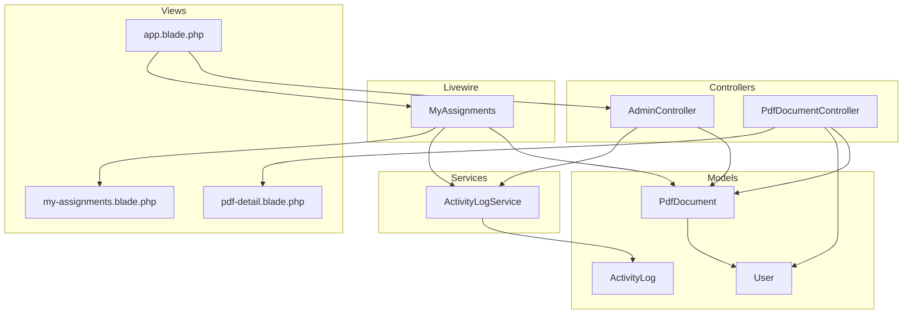
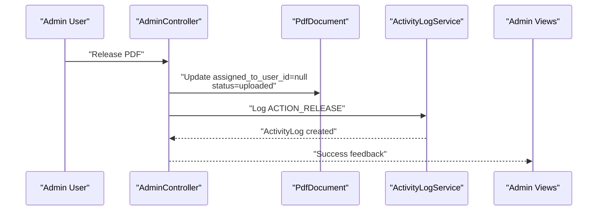
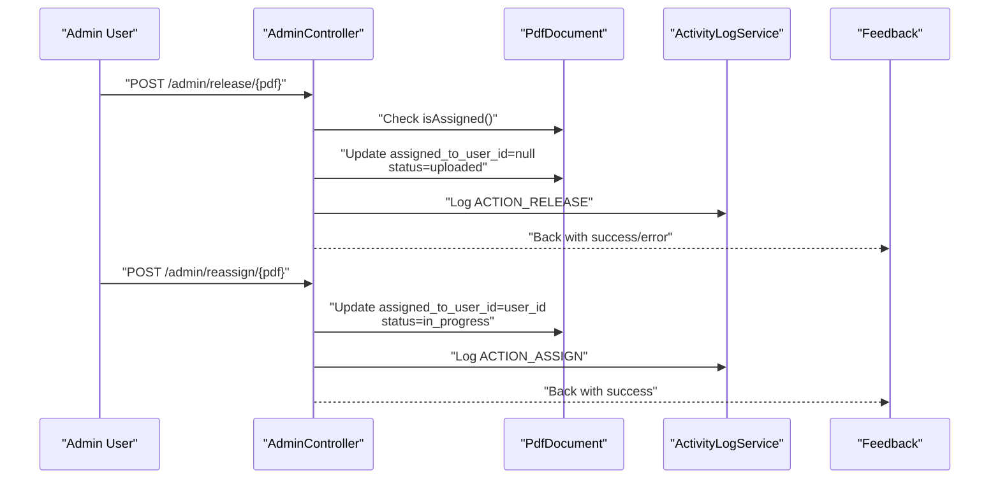
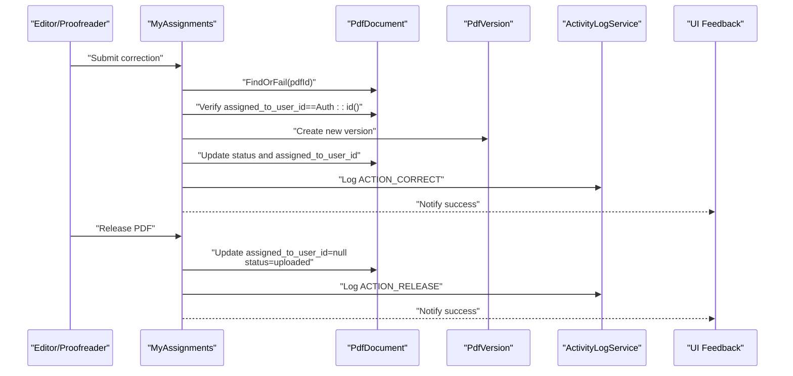
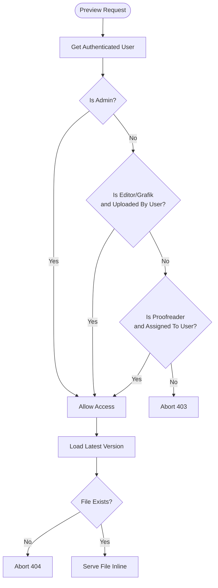
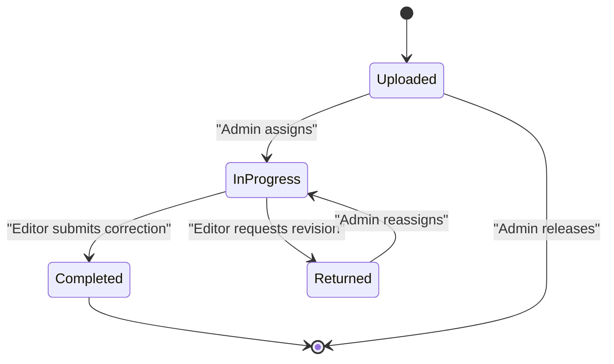
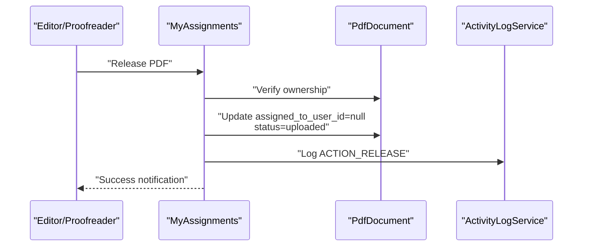
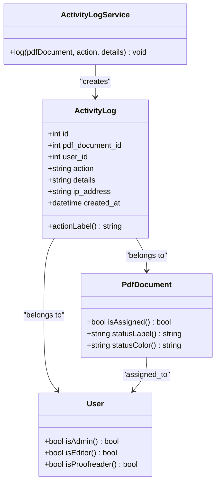

# User Assignment Workflows

<cite>
**Referenced Files in This Document**
- [AdminController.php](file://app/Http/Controllers/AdminController.php)
- [MyAssignments.php](file://app/Livewire/MyAssignments.php)
- [PdfDocumentController.php](file://app/Http/Controllers/PdfDocumentController.php)
- [PdfDocument.php](file://app/Models/PdfDocument.php)
- [User.php](file://app/Models/User.php)
- [ActivityLogService.php](file://app/Services/ActivityLogService.php)
- [ActivityLog.php](file://app/Models/ActivityLog.php)
- [my-assignments.blade.php](file://resources/views/livewire/my-assignments.blade.php)
- [pdf-detail.blade.php](file://resources/views/livewire/pdf-detail.blade.php)
- [app.blade.php](file://resources/views/layouts/app.blade.php)
- [web.php](file://routes/web.php)
</cite>

## Table of Contents
1. [Introduction](#introduction)
2. [Project Structure](#project-structure)
3. [Core Components](#core-components)
4. [Architecture Overview](#architecture-overview)
5. [Detailed Component Analysis](#detailed-component-analysis)
6. [Assignment Criteria and Algorithms](#assignment-criteria-and-algorithms)
7. [Status Tracking and Progress Monitoring](#status-tracking-and-progress-monitoring)
8. [Deadline Management and Reminders](#deadline-management-and-reminders)
9. [Reassignment Procedures and Approval Workflows](#reassignment-procedures-and-approval-workflows)
10. [Bulk Operations and Automated Assignment](#bulk-operations-and-automated-assignment)
11. [Conflict Resolution](#conflict-resolution)
12. [Assignment Analytics and Reporting](#assignment-analytics-and-reporting)
13. [Troubleshooting Guide](#troubleshooting-guide)
14. [Conclusion](#conclusion)

## Introduction
This document provides comprehensive documentation for user assignment workflows within the PDF correction system. It explains how administrators assign documents to editors and proofreaders, outlines assignment criteria, describes status tracking and progress monitoring, details deadline management, covers reassignment procedures, and addresses bulk operations and conflict resolution. Administrative oversight is supported through activity logging and status reporting.

## Project Structure
The assignment workflow spans controller actions, Livewire components, Eloquent models, services, and Blade templates. Key areas include:
- Admin controller actions for release and reassignment
- Livewire component for editor/proofreader assignments
- PDF document model with status and assignment helpers
- User model with role-based access checks
- Activity logging service and model for administrative oversight
- Blade templates for UI presentation and navigation

**Diagram sources**
- [AdminController.php:13-60](file://app/Http/Controllers/AdminController.php#L13-L60)
- [MyAssignments.php:16-120](file://app/Livewire/MyAssignments.php#L16-L120)
- [PdfDocumentController.php:42-81](file://app/Http/Controllers/PdfDocumentController.php#L42-L81)
- [PdfDocument.php:94-129](file://app/Models/PdfDocument.php#L94-L129)
- [User.php](file://app/Models/User.php)
- [ActivityLogService.php:20-29](file://app/Services/ActivityLogService.php#L20-L29)
- [ActivityLog.php:13-59](file://app/Models/ActivityLog.php#L13-L59)
- [my-assignments.blade.php:118-134](file://resources/views/livewire/my-assignments.blade.php#L118-L134)
- [pdf-detail.blade.php:21-46](file://resources/views/livewire/pdf-detail.blade.php#L21-L46)
- [app.blade.php:21-32](file://resources/views/layouts/app.blade.php#L21-L32)

**Section sources**
- [AdminController.php:13-60](file://app/Http/Controllers/AdminController.php#L13-L60)
- [MyAssignments.php:16-120](file://app/Livewire/MyAssignments.php#L16-L120)
- [PdfDocumentController.php:42-81](file://app/Http/Controllers/PdfDocumentController.php#L42-L81)
- [PdfDocument.php:94-129](file://app/Models/PdfDocument.php#L94-L129)
- [User.php](file://app/Models/User.php)
- [ActivityLogService.php:20-29](file://app/Services/ActivityLogService.php#L20-L29)
- [ActivityLog.php:13-59](file://app/Models/ActivityLog.php#L13-L59)
- [my-assignments.blade.php:118-134](file://resources/views/livewire/my-assignments.blade.php#L118-L134)
- [pdf-detail.blade.php:21-46](file://resources/views/livewire/pdf-detail.blade.php#L21-L46)
- [app.blade.php:21-32](file://resources/views/layouts/app.blade.php#L21-L32)

## Core Components
- AdminController: Provides release and reassignment actions for PDF documents with validation and activity logging.
- MyAssignments (Livewire): Handles editor/proofreader upload submission, correction release, and displays assigned documents with deadlines and statuses.
- PdfDocumentController: Controls access to PDF previews based on user roles and current assignment state.
- PdfDocument model: Encapsulates document status, assignment state, and helper methods for UI labeling.
- User model: Defines roles (editor, proofreader, admin) used for access control.
- ActivityLogService and ActivityLog: Centralized logging for all assignment-related actions.
- Blade templates: Present assignment lists, deadlines, statuses, and navigation for administrators and users.

**Section sources**
- [AdminController.php:13-60](file://app/Http/Controllers/AdminController.php#L13-L60)
- [MyAssignments.php:16-120](file://app/Livewire/MyAssignments.php#L16-L120)
- [PdfDocumentController.php:42-81](file://app/Http/Controllers/PdfDocumentController.php#L42-L81)
- [PdfDocument.php:94-129](file://app/Models/PdfDocument.php#L94-L129)
- [User.php](file://app/Models/User.php)
- [ActivityLogService.php:20-29](file://app/Services/ActivityLogService.php#L20-L29)
- [ActivityLog.php:13-59](file://app/Models/ActivityLog.php#L13-L59)

## Architecture Overview
The assignment workflow follows a layered architecture:
- Presentation layer: Livewire components and Blade templates
- Application layer: Controllers and Livewire components orchestrating actions
- Domain layer: Models representing documents, users, and activity logs
- Infrastructure layer: Services for logging and persistence

**Diagram sources**
- [AdminController.php:13-37](file://app/Http/Controllers/AdminController.php#L13-L37)
- [ActivityLogService.php:20-29](file://app/Services/ActivityLogService.php#L20-L29)
- [ActivityLog.php:13-59](file://app/Models/ActivityLog.php#L13-L59)

**Section sources**
- [AdminController.php:13-37](file://app/Http/Controllers/AdminController.php#L13-L37)
- [ActivityLogService.php:20-29](file://app/Services/ActivityLogService.php#L20-L29)
- [ActivityLog.php:13-59](file://app/Models/ActivityLog.php#L13-L59)

## Detailed Component Analysis

### AdminController: Release and Reassignment Actions
- Release PDF: Validates that the document is currently assigned, clears assignment, updates status to uploaded, and logs the action with optional reason.
- Reassign PDF: Validates user existence, assigns the document to a new user, sets status to in progress, and logs the action with optional reason.

**Diagram sources**
- [AdminController.php:13-60](file://app/Http/Controllers/AdminController.php#L13-L60)
- [ActivityLogService.php:20-29](file://app/Services/ActivityLogService.php#L20-L29)

**Section sources**
- [AdminController.php:13-60](file://app/Http/Controllers/AdminController.php#L13-L60)

### MyAssignments (Livewire): Correction Submission and Release
- Upload initiation: Sets the target PDF ID and resets form fields.
- Correction submission: Validates file and summary, ensures the document is assigned to the current user, creates a new version, updates status (completed or returned), logs the correction, and notifies the user.
- Release PDF: Confirms ownership, clears assignment, resets status to uploaded, and logs the release.

**Diagram sources**
- [MyAssignments.php:31-107](file://app/Livewire/MyAssignments.php#L31-L107)
- [ActivityLogService.php:20-29](file://app/Services/ActivityLogService.php#L20-L29)

**Section sources**
- [MyAssignments.php:31-107](file://app/Livewire/MyAssignments.php#L31-L107)

### Access Control and Preview
- Access control: Administrators can view all documents; editors can view documents they uploaded; proofreaders can view documents assigned to them.
- Preview: Returns the latest version file with appropriate headers for inline viewing.

**Diagram sources**
- [PdfDocumentController.php:42-81](file://app/Http/Controllers/PdfDocumentController.php#L42-L81)

**Section sources**
- [PdfDocumentController.php:42-81](file://app/Http/Controllers/PdfDocumentController.php#L42-L81)

### UI Components and Navigation
- Navigation: Admin menu exposes assignment-related pages for editors and proofreaders.
- My Assignments page: Lists assigned documents ordered by deadline, shows status badges, and provides actions for uploading corrections and releasing assignments.
- PDF Detail page: Displays deadline, uploader, and current assignee with status indicators.

**Section sources**
- [app.blade.php:21-32](file://resources/views/layouts/app.blade.php#L21-L32)
- [my-assignments.blade.php:118-134](file://resources/views/livewire/my-assignments.blade.php#L118-L134)
- [pdf-detail.blade.php:21-46](file://resources/views/livewire/pdf-detail.blade.php#L21-L46)

## Assignment Criteria and Algorithms
Current implementation focuses on explicit assignment via admin actions and user self-release. No automated matching by document type, user skills, or workload balancing is present in the analyzed code. The system relies on administrator decisions and user-initiated releases.

Key observations:
- Document type matching: Not implemented in the analyzed code.
- User skill levels: Not implemented in the analyzed code.
- Workload balancing: Not implemented in the analyzed code.
- Deadline enforcement: UI highlights past deadlines; no automated enforcement mechanisms are visible in the analyzed code.

**Section sources**
- [AdminController.php:39-60](file://app/Http/Controllers/AdminController.php#L39-L60)
- [MyAssignments.php:90-107](file://app/Livewire/MyAssignments.php#L90-L107)
- [my-assignments.blade.php:128-131](file://resources/views/livewire/my-assignments.blade.php#L128-L131)

## Status Tracking and Progress Monitoring
- Document statuses: Uploaded, In Progress, Returned, Completed with localized labels and color coding.
- Assignment state: Boolean helper indicates whether a document is assigned.
- Activity logging: Comprehensive logging of all assignment-related actions for auditing and reporting.
- UI indicators: Status badges and color coding help monitor progress at a glance.

**Diagram sources**
- [PdfDocument.php:108-129](file://app/Models/PdfDocument.php#L108-L129)
- [ActivityLog.php:13-59](file://app/Models/ActivityLog.php#L13-L59)

**Section sources**
- [PdfDocument.php:108-129](file://app/Models/PdfDocument.php#L108-L129)
- [ActivityLog.php:13-59](file://app/Models/ActivityLog.php#L13-L59)

## Deadline Management and Reminders
- Deadline display: UI shows deadline dates and highlights past due dates for overdue items.
- No automated reminders or escalation mechanisms are present in the analyzed code.
- Past-due documents are visually emphasized but no backend automation triggers notifications.

**Section sources**
- [my-assignments.blade.php:128-131](file://resources/views/livewire/my-assignments.blade.php#L128-L131)
- [pdf-detail.blade.php:29-33](file://resources/views/livewire/pdf-detail.blade.php#L29-L33)

## Reassignment Procedures and Approval Workflows
- Admin release: Clears assignment and resets status to uploaded; requires reason input.
- Admin reassignment: Assigns to a specified user and sets status to in progress; requires reason input.
- Editor/proofreader release: Self-service release back to the pool; validates ownership before updating.

**Diagram sources**
- [MyAssignments.php:90-107](file://app/Livewire/MyAssignments.php#L90-L107)
- [ActivityLogService.php:20-29](file://app/Services/ActivityLogService.php#L20-L29)

**Section sources**
- [AdminController.php:13-60](file://app/Http/Controllers/AdminController.php#L13-L60)
- [MyAssignments.php:90-107](file://app/Livewire/MyAssignments.php#L90-L107)

## Bulk Operations and Automated Assignment
- Bulk assignment: Not implemented in the analyzed code.
- Automated assignment algorithms: Not implemented in the analyzed code.
- Current operations are per-document via admin actions and user self-service.

**Section sources**
- [AdminController.php:39-60](file://app/Http/Controllers/AdminController.php#L39-L60)
- [MyAssignments.php:31-40](file://app/Livewire/MyAssignments.php#L31-L40)

## Conflict Resolution
- Ownership validation: Users can only submit corrections for documents assigned to themselves.
- Self-release prevents conflicts by returning documents to the pool.
- No explicit conflict detection for simultaneous access attempts is present in the analyzed code.

**Section sources**
- [MyAssignments.php:46-48](file://app/Livewire/MyAssignments.php#L46-L48)
- [MyAssignments.php:94-97](file://app/Livewire/MyAssignments.php#L94-L97)

## Assignment Analytics and Reporting
- Activity logs: Centralized logging of all actions including assignment, release, correction, and view events.
- Role-based navigation: Admin menu provides access to administrative views.
- Status indicators: Color-coded badges and labels support quick assessment of workflow health.

**Diagram sources**
- [ActivityLogService.php:20-29](file://app/Services/ActivityLogService.php#L20-L29)
- [ActivityLog.php:13-59](file://app/Models/ActivityLog.php#L13-L59)
- [PdfDocument.php:94-129](file://app/Models/PdfDocument.php#L94-L129)
- [User.php](file://app/Models/User.php)

**Section sources**
- [ActivityLogService.php:20-29](file://app/Services/ActivityLogService.php#L20-L29)
- [ActivityLog.php:13-59](file://app/Models/ActivityLog.php#L13-L59)
- [PdfDocument.php:94-129](file://app/Models/PdfDocument.php#L94-L129)
- [User.php](file://app/Models/User.php)

## Troubleshooting Guide
- Access denied errors: Occur when attempting to preview PDFs without proper role-based permissions.
- Ownership validation failures: Prevent correction submission if the document is not assigned to the current user.
- Missing files: Preview returns 404 when the latest version file is not found.
- Logging gaps: Verify activity logs for assignment actions to confirm successful operations.

**Section sources**
- [PdfDocumentController.php:46-55](file://app/Http/Controllers/PdfDocumentController.php#L46-L55)
- [MyAssignments.php:46-48](file://app/Livewire/MyAssignments.php#L46-L48)
- [PdfDocumentController.php:53-55](file://app/Http/Controllers/PdfDocumentController.php#L53-L55)

## Conclusion
The PDF correction system implements explicit, role-based assignment workflows with strong administrative controls and comprehensive activity logging. While current features include admin release and reassignment, editor/proofreader self-service release, and status tracking, advanced capabilities such as automated assignment algorithms, bulk operations, and deadline reminders are not present in the analyzed code. Administrative oversight is supported through centralized activity logs and UI indicators.