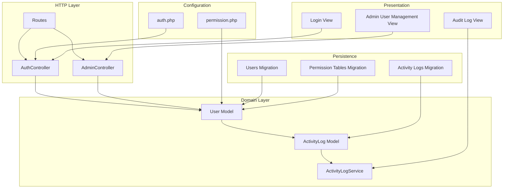
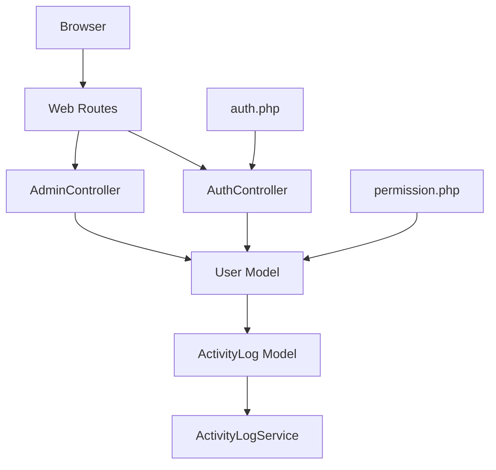
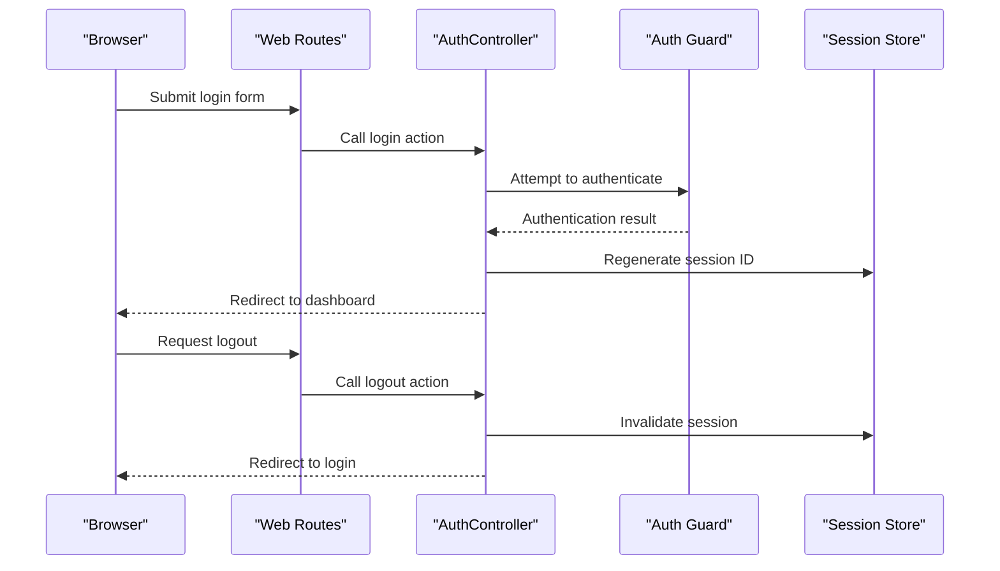
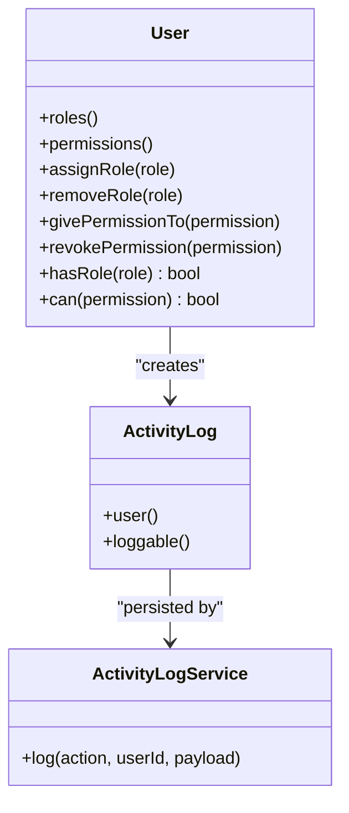
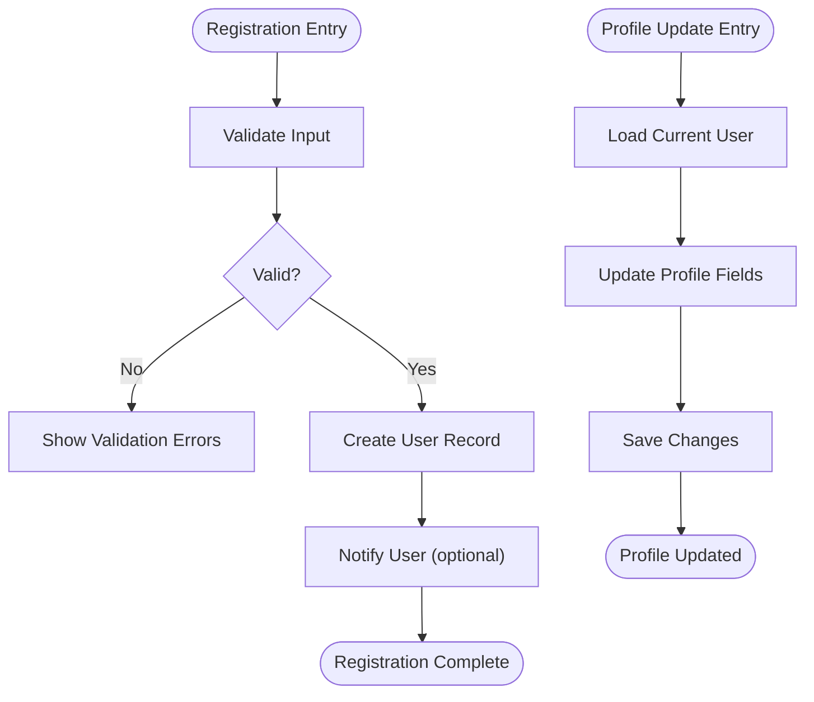
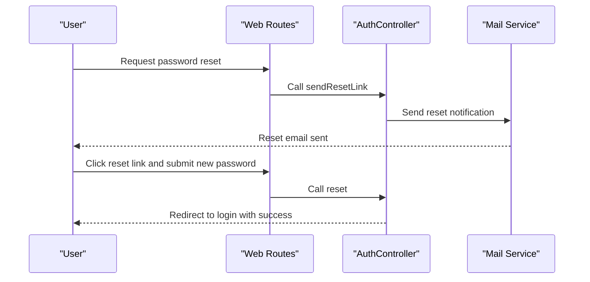
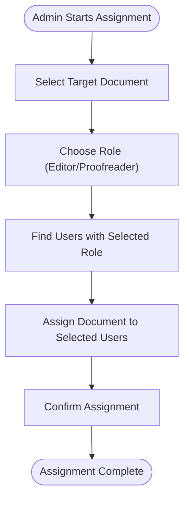
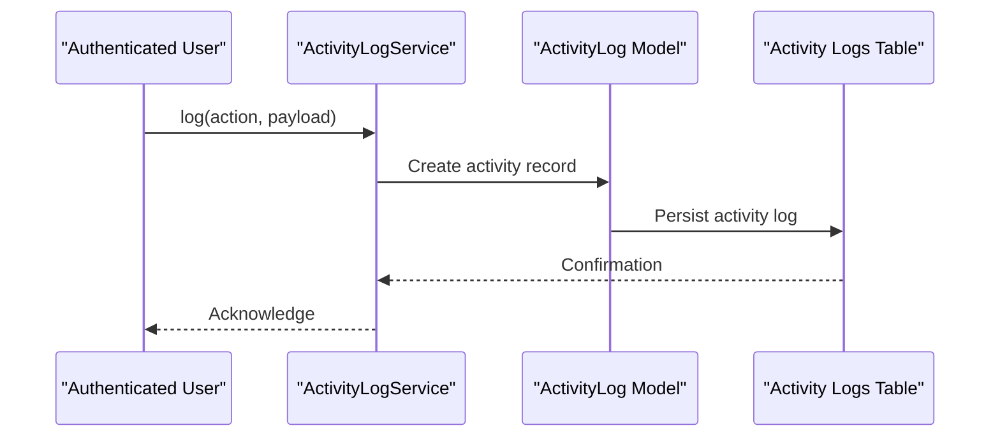
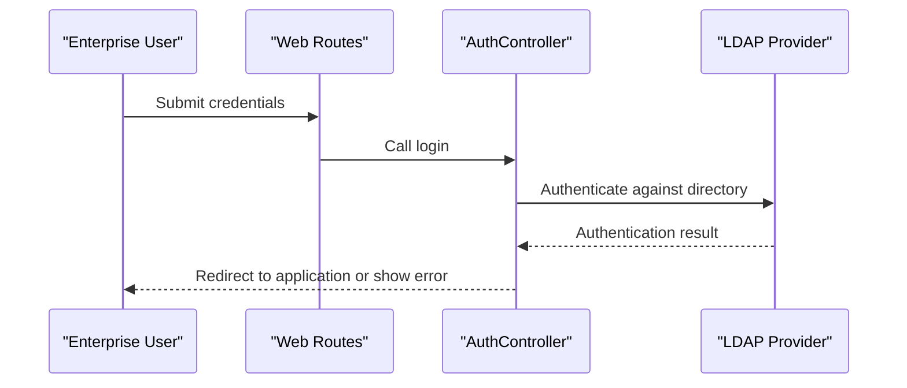
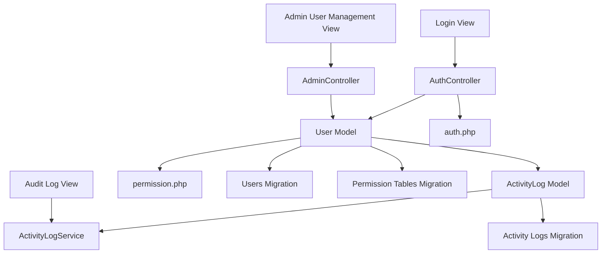

# User Management

<cite>
**Referenced Files in This Document**
- [AuthController.php](file://pdf-korektura/app/Http/Controllers/AuthController.php)
- [AdminController.php](file://pdf-korektura/app/Http/Controllers/AdminController.php)
- [User.php](file://pdf-korektura/app/Models/User.php)
- [ActivityLog.php](file://pdf-korektura/app/Models/ActivityLog.php)
- [ActivityLogService.php](file://pdf-korektura/app/Services/ActivityLogService.php)
- [permission.php](file://pdf-korektura/config/permission.php)
- [auth.php](file://pdf-korektura/config/auth.php)
- [2024_06_10_100000_create_permission_tables.php](file://pdf-korektura/database/migrations/2024_06_10_100000_create_permission_tables.php)
- [0001_01_01_000000_create_users_table.php](file://pdf-korektura/database/migrations/0001_01_01_000000_create_users_table.php)
- [login.blade.php](file://pdf-korektura/resources/views/auth/login.blade.php)
- [user-management.blade.php](file://pdf-korektura/resources/views/livewire/admin/user-management.blade.php)
- [audit-log.blade.php](file://pdf-korektura/resources/views/livewire/admin/audit-log.blade.php)
- [web.php](file://pdf-korektura/routes/web.php)
- [AppServiceProvider.php](file://pdf-korektura/app/Providers/AppServiceProvider.php)
</cite>

## Table of Contents
1. [Introduction](#introduction)
2. [Project Structure](#project-structure)
3. [Core Components](#core-components)
4. [Architecture Overview](#architecture-overview)
5. [Detailed Component Analysis](#detailed-component-analysis)
6. [Dependency Analysis](#dependency-analysis)
7. [Performance Considerations](#performance-considerations)
8. [Troubleshooting Guide](#troubleshooting-guide)
9. [Conclusion](#conclusion)

## Introduction
This document provides comprehensive user management documentation for the PDF correction system. It covers authentication and session management, role-based access control using Spatie Laravel Permission, user registration and profile management, password reset functionality, user assignment workflows, activity tracking and audit trails, and LDAP integration for enterprise environments. The goal is to enable administrators and developers to understand how users are managed, secured, and tracked within the system.

## Project Structure
The user management functionality spans controllers, models, services, configuration files, migrations, and Blade views. Authentication is handled via a dedicated controller, while authorization leverages Spatie Laravel Permission. Activity logging is implemented through a model and service. Administrative user management is exposed via Livewire components and Blade templates.

**Diagram sources**
- [AuthController.php](file://pdf-korektura/app/Http/Controllers/AuthController.php)
- [AdminController.php](file://pdf-korektura/app/Http/Controllers/AdminController.php)
- [User.php](file://pdf-korektura/app/Models/User.php)
- [ActivityLog.php](file://pdf-korektura/app/Models/ActivityLog.php)
- [ActivityLogService.php](file://pdf-korektura/app/Services/ActivityLogService.php)
- [auth.php](file://pdf-korektura/config/auth.php)
- [permission.php](file://pdf-korektura/config/permission.php)
- [0001_01_01_000000_create_users_table.php](file://pdf-korektura/database/migrations/0001_01_01_000000_create_users_table.php)
- [2024_06_10_100000_create_permission_tables.php](file://pdf-korektura/database/migrations/2024_06_10_100000_create_permission_tables.php)
- [login.blade.php](file://pdf-korektura/resources/views/auth/login.blade.php)
- [user-management.blade.php](file://pdf-korektura/resources/views/livewire/admin/user-management.blade.php)
- [audit-log.blade.php](file://pdf-korektura/resources/views/livewire/admin/audit-log.blade.php)

**Section sources**
- [AuthController.php](file://pdf-korektura/app/Http/Controllers/AuthController.php)
- [User.php](file://pdf-korektura/app/Models/User.php)
- [auth.php](file://pdf-korektura/config/auth.php)
- [permission.php](file://pdf-korektura/config/permission.php)
- [0001_01_01_000000_create_users_table.php](file://pdf-korektura/database/migrations/0001_01_01_000000_create_users_table.php)
- [2024_06_10_100000_create_permission_tables.php](file://pdf-korektura/database/migrations/2024_06_10_100000_create_permission_tables.php)
- [login.blade.php](file://pdf-korektura/resources/views/auth/login.blade.php)
- [user-management.blade.php](file://pdf-korektura/resources/views/livewire/admin/user-management.blade.php)
- [audit-log.blade.php](file://pdf-korektura/resources/views/livewire/admin/audit-log.blade.php)

## Core Components
- Authentication Controller: Handles login, logout, and session lifecycle.
- User Model: Represents users and integrates with Spatie Laravel Permission for roles and permissions.
- Activity Log Model and Service: Capture and manage user actions for auditing.
- Configuration: Defines guards, providers, and Spatie Permission settings.
- Migrations: Create users table and Spatie permission-related tables.
- Views: Provide login UI and administrative management UI for users and audit logs.

Key responsibilities:
- Authentication: Validate credentials, establish sessions, invalidate sessions on logout.
- Authorization: Enforce role-based access control using Spatie roles and permissions.
- User Management: Registration, profile updates, and administrative user operations.
- Security: Password reset, secure session handling, and audit trail generation.
- Enterprise Integration: LDAP support for centralized authentication.

**Section sources**
- [AuthController.php](file://pdf-korektura/app/Http/Controllers/AuthController.php)
- [User.php](file://pdf-korektura/app/Models/User.php)
- [ActivityLog.php](file://pdf-korektura/app/Models/ActivityLog.php)
- [ActivityLogService.php](file://pdf-korektura/app/Services/ActivityLogService.php)
- [auth.php](file://pdf-korektura/config/auth.php)
- [permission.php](file://pdf-korektura/config/permission.php)
- [2024_06_10_100000_create_permission_tables.php](file://pdf-korektura/database/migrations/2024_06_10_100000_create_permission_tables.php)
- [0001_01_01_000000_create_users_table.php](file://pdf-korektura/database/migrations/0001_01_01_000000_create_users_table.php)
- [login.blade.php](file://pdf-korektura/resources/views/auth/login.blade.php)
- [user-management.blade.php](file://pdf-korektura/resources/views/livewire/admin/user-management.blade.php)
- [audit-log.blade.php](file://pdf-korektura/resources/views/livewire/admin/audit-log.blade.php)

## Architecture Overview
The system follows a layered architecture:
- HTTP Layer: Routes dispatch to controllers.
- Domain Layer: Controllers interact with the User model and ActivityLogService.
- Persistence Layer: Eloquent models map to database tables created by migrations.
- Presentation Layer: Blade views render login and administrative UIs.
- Configuration Layer: auth.php and permission.php define guards, providers, and Spatie settings.

**Diagram sources**
- [web.php](file://pdf-korektura/routes/web.php)
- [AuthController.php](file://pdf-korektura/app/Http/Controllers/AuthController.php)
- [AdminController.php](file://pdf-korektura/app/Http/Controllers/AdminController.php)
- [User.php](file://pdf-korektura/app/Models/User.php)
- [ActivityLogService.php](file://pdf-korektura/app/Services/ActivityLogService.php)
- [ActivityLog.php](file://pdf-korektura/app/Models/ActivityLog.php)
- [auth.php](file://pdf-korektura/config/auth.php)
- [permission.php](file://pdf-korektura/config/permission.php)

## Detailed Component Analysis

### Authentication System
The authentication system manages user login, logout, and session lifecycle. It validates credentials against the configured provider and establishes authenticated sessions. Logout invalidates the current session.

**Diagram sources**
- [AuthController.php](file://pdf-korektura/app/Http/Controllers/AuthController.php)
- [auth.php](file://pdf-korektura/config/auth.php)
- [login.blade.php](file://pdf-korektura/resources/views/auth/login.blade.php)

**Section sources**
- [AuthController.php](file://pdf-korektura/app/Http/Controllers/AuthController.php)
- [auth.php](file://pdf-korektura/config/auth.php)
- [login.blade.php](file://pdf-korektura/resources/views/auth/login.blade.php)

### Role-Based Access Control (RBAC) with Spatie Laravel Permission
The system uses Spatie Laravel Permission to implement RBAC. Roles and permissions are stored in dedicated tables and associated with users via the User model. Guards and providers are configured in auth.php, while Spatie-specific settings are defined in permission.php.

**Diagram sources**
- [User.php](file://pdf-korektura/app/Models/User.php)
- [ActivityLog.php](file://pdf-korektura/app/Models/ActivityLog.php)
- [ActivityLogService.php](file://pdf-korektura/app/Services/ActivityLogService.php)
- [permission.php](file://pdf-korektura/config/permission.php)
- [2024_06_10_100000_create_permission_tables.php](file://pdf-korektura/database/migrations/2024_06_10_100000_create_permission_tables.php)

**Section sources**
- [User.php](file://pdf-korektura/app/Models/User.php)
- [permission.php](file://pdf-korektura/config/permission.php)
- [2024_06_10_100000_create_permission_tables.php](file://pdf-korektura/database/migrations/2024_06_10_100000_create_permission_tables.php)

### User Registration and Profile Management
User registration creates new user records in the users table. Profile management allows users to update personal information. Administrative users can manage profiles via Livewire components.

**Diagram sources**
- [0001_01_01_000000_create_users_table.php](file://pdf-korektura/database/migrations/0001_01_01_000000_create_users_table.php)
- [user-management.blade.php](file://pdf-korektura/resources/views/livewire/admin/user-management.blade.php)

**Section sources**
- [0001_01_01_000000_create_users_table.php](file://pdf-korektura/database/migrations/0001_01_01_000000_create_users_table.php)
- [user-management.blade.php](file://pdf-korektura/resources/views/livewire/admin/user-management.blade.php)

### Password Reset Functionality
Password reset enables users to recover access to their accounts. The system integrates with the configured auth provider to issue reset tokens and update passwords securely.

**Diagram sources**
- [AuthController.php](file://pdf-korektura/app/Http/Controllers/AuthController.php)
- [auth.php](file://pdf-korektura/config/auth.php)

**Section sources**
- [AuthController.php](file://pdf-korektura/app/Http/Controllers/AuthController.php)
- [auth.php](file://pdf-korektura/config/auth.php)

### User Assignment Workflows
Administrators can assign documents to editors and proofreaders. This involves selecting users with appropriate roles and linking them to specific PDF documents. The assignment process respects role permissions to ensure only authorized users can access assigned documents.

**Section sources**
- [AdminController.php](file://pdf-korektura/app/Http/Controllers/AdminController.php)
- [User.php](file://pdf-korektura/app/Models/User.php)

### User Activity Tracking and Audit Trails
The system captures user activities through the ActivityLog model and service. Every significant action performed by a user is logged with metadata such as the actor, action type, target, and timestamp. Administrators can review audit logs to monitor system usage and detect anomalies.

**Diagram sources**
- [ActivityLog.php](file://pdf-korektura/app/Models/ActivityLog.php)
- [ActivityLogService.php](file://pdf-korektura/app/Services/ActivityLogService.php)
- [2024_06_10_140000_create_activity_logs_table.php](file://pdf-korektura/database/migrations/2024_06_10_140000_create_activity_logs_table.php)
- [audit-log.blade.php](file://pdf-korektura/resources/views/livewire/admin/audit-log.blade.php)

**Section sources**
- [ActivityLog.php](file://pdf-korektura/app/Models/ActivityLog.php)
- [ActivityLogService.php](file://pdf-korektura/app/Services/ActivityLogService.php)
- [audit-log.blade.php](file://pdf-korektura/resources/views/livewire/admin/audit-log.blade.php)

### LDAP Integration for Enterprise Authentication
LDAP integration supports enterprise authentication scenarios by allowing users to authenticate against an external directory server. The system leverages the configured LDAP provider to validate credentials and synchronize user attributes.

**Diagram sources**
- [auth.php](file://pdf-korektura/config/auth.php)
- [AppServiceProvider.php](file://pdf-korektura/app/Providers/AppServiceProvider.php)

**Section sources**
- [auth.php](file://pdf-korektura/config/auth.php)
- [AppServiceProvider.php](file://pdf-korektura/app/Providers/AppServiceProvider.php)

## Dependency Analysis
The user management subsystem exhibits clear separation of concerns:
- Controllers depend on the User model and ActivityLogService.
- The User model depends on Spatie Permission traits and Eloquent ORM.
- Activity logging depends on the ActivityLog model and service.
- Configuration files define the integration points for authentication and authorization.
- Views provide the presentation layer for login and administrative tasks.

**Diagram sources**
- [AuthController.php](file://pdf-korektura/app/Http/Controllers/AuthController.php)
- [AdminController.php](file://pdf-korektura/app/Http/Controllers/AdminController.php)
- [User.php](file://pdf-korektura/app/Models/User.php)
- [ActivityLog.php](file://pdf-korektura/app/Models/ActivityLog.php)
- [ActivityLogService.php](file://pdf-korektura/app/Services/ActivityLogService.php)
- [auth.php](file://pdf-korektura/config/auth.php)
- [permission.php](file://pdf-korektura/config/permission.php)
- [0001_01_01_000000_create_users_table.php](file://pdf-korektura/database/migrations/0001_01_01_000000_create_users_table.php)
- [2024_06_10_100000_create_permission_tables.php](file://pdf-korektura/database/migrations/2024_06_10_100000_create_permission_tables.php)
- [login.blade.php](file://pdf-korektura/resources/views/auth/login.blade.php)
- [user-management.blade.php](file://pdf-korektura/resources/views/livewire/admin/user-management.blade.php)
- [audit-log.blade.php](file://pdf-korektura/resources/views/livewire/admin/audit-log.blade.php)

**Section sources**
- [AuthController.php](file://pdf-korektura/app/Http/Controllers/AuthController.php)
- [AdminController.php](file://pdf-korektura/app/Http/Controllers/AdminController.php)
- [User.php](file://pdf-korektura/app/Models/User.php)
- [ActivityLog.php](file://pdf-korektura/app/Models/ActivityLog.php)
- [ActivityLogService.php](file://pdf-korektura/app/Services/ActivityLogService.php)
- [auth.php](file://pdf-korektura/config/auth.php)
- [permission.php](file://pdf-korektura/config/permission.php)
- [0001_01_01_000000_create_users_table.php](file://pdf-korektura/database/migrations/0001_01_01_000000_create_users_table.php)
- [2024_06_10_100000_create_permission_tables.php](file://pdf-korektura/database/migrations/2024_06_10_100000_create_permission_tables.php)
- [login.blade.php](file://pdf-korektura/resources/views/auth/login.blade.php)
- [user-management.blade.php](file://pdf-korektura/resources/views/livewire/admin/user-management.blade.php)
- [audit-log.blade.php](file://pdf-korektura/resources/views/livewire/admin/audit-log.blade.php)

## Performance Considerations
- Session Management: Use secure, HTTP-only cookies and regenerate session IDs after login to mitigate session fixation attacks.
- Database Queries: Optimize queries for role and permission checks; consider caching frequently accessed role/permission data.
- Activity Logging: Batch or queue activity log writes to reduce latency during high-volume operations.
- LDAP Authentication: Configure connection pooling and timeouts to handle directory server load and network latency.

## Troubleshooting Guide
Common issues and resolutions:
- Authentication Failures: Verify guard and provider configurations in auth.php; check credential validation and session regeneration logic.
- Permission Denied Errors: Confirm roles and permissions are correctly assigned in the permission tables; ensure middleware is applied to protected routes.
- LDAP Authentication Problems: Validate LDAP provider settings and connectivity; test bind credentials and user search filters.
- Audit Log Gaps: Ensure ActivityLogService is invoked for all critical actions; verify database permissions and migration completeness.

**Section sources**
- [auth.php](file://pdf-korektura/config/auth.php)
- [permission.php](file://pdf-korektura/config/permission.php)
- [ActivityLogService.php](file://pdf-korektura/app/Services/ActivityLogService.php)
- [2024_06_10_140000_create_activity_logs_table.php](file://pdf-korektura/database/migrations/2024_06_10_140000_create_activity_logs_table.php)

## Conclusion
The PDF correction system implements robust user management through integrated authentication, Spatie Laravel Permission-based RBAC, comprehensive activity logging, and optional LDAP support. Administrators can efficiently manage users, assign documents, and monitor system activity. Developers can extend and customize the system by leveraging the modular architecture and configuration files.