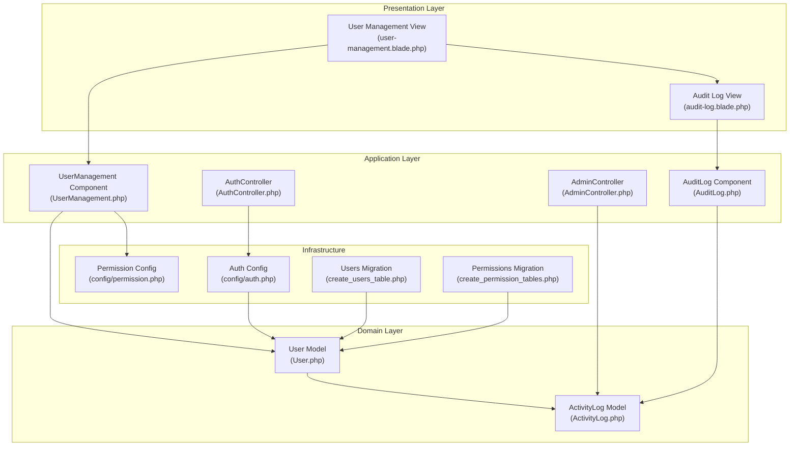
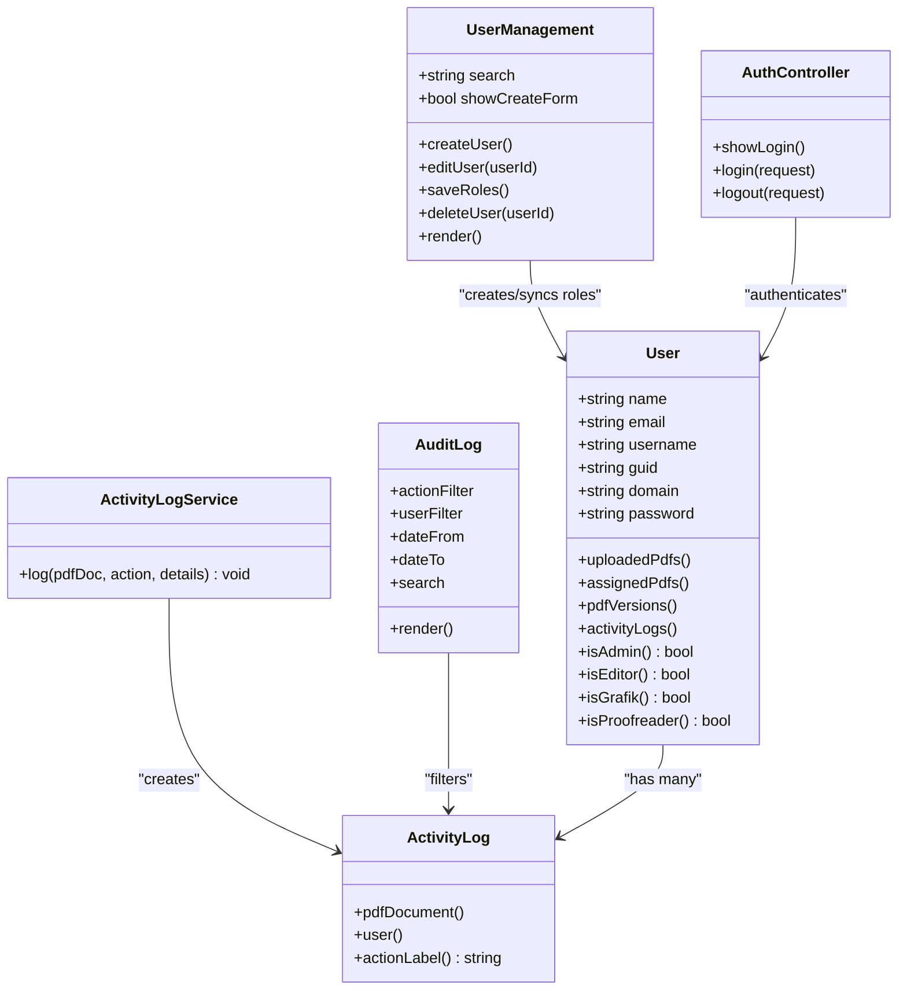
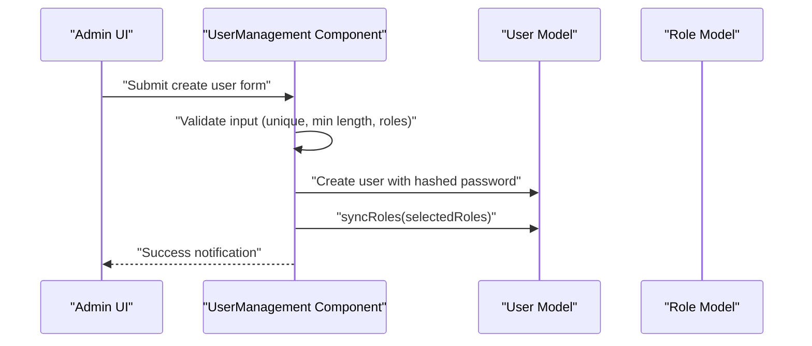
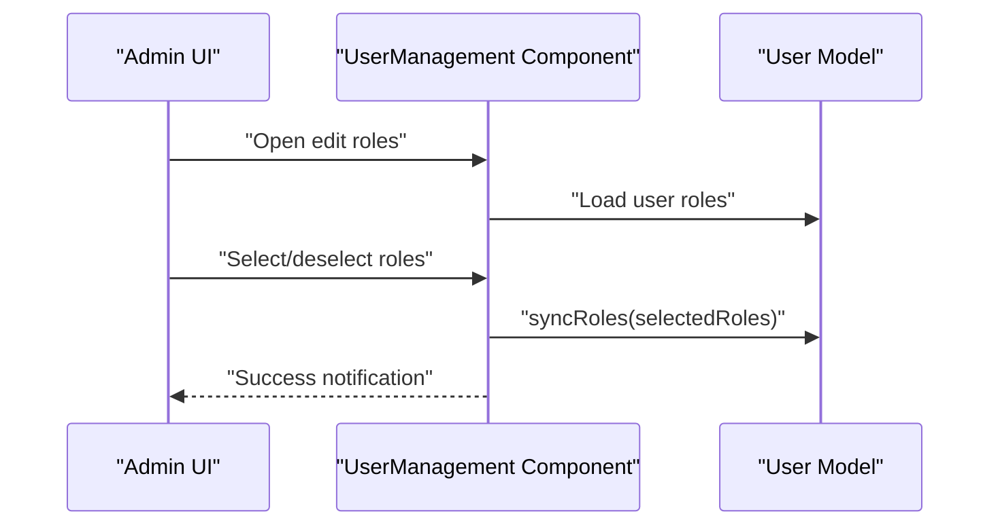
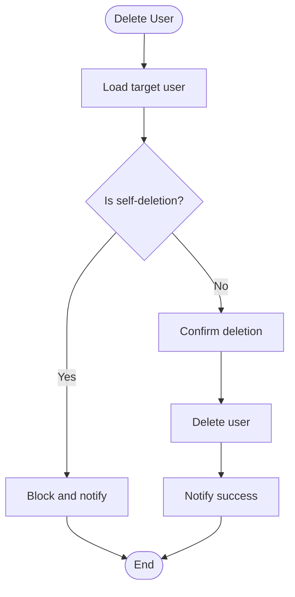
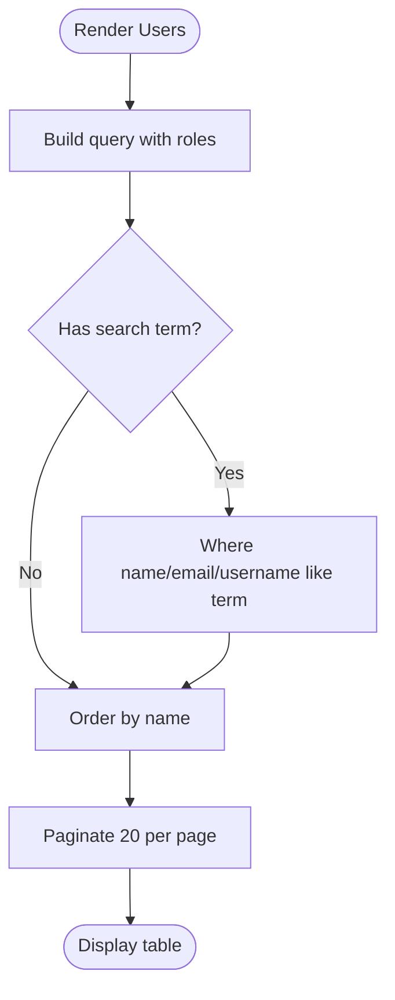
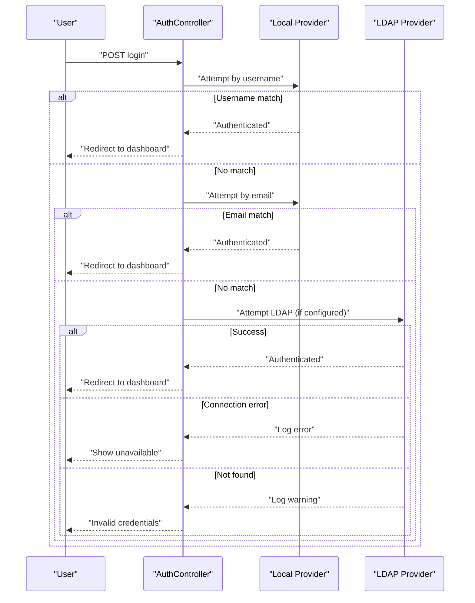
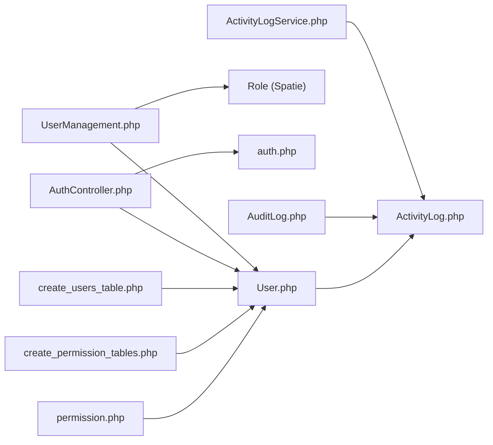

# User Profile Management

<cite>
**Referenced Files in This Document**
- [User.php](file://app/Models/User.php)
- [UserManagement.php](file://app/Livewire/Admin/UserManagement.php)
- [user-management.blade.php](file://resources/views/livewire/admin/user-management.blade.php)
- [AuthController.php](file://app/Http/Controllers/AuthController.php)
- [auth.php](file://config/auth.php)
- [create_users_table.php](file://database/migrations/0001_01_01_000000_create_users_table.php)
- [create_permission_tables.php](file://database/migrations/2024_06_10_100000_create_permission_tables.php)
- [permission.php](file://config/permission.php)
- [ActivityLogService.php](file://app/Services/ActivityLogService.php)
- [ActivityLog.php](file://app/Models/ActivityLog.php)
- [AuditLog.php](file://app/Livewire/Admin/AuditLog.php)
- [AdminController.php](file://app/Http/Controllers/AdminController.php)
</cite>

## Table of Contents
1. [Introduction](#introduction)
2. [Project Structure](#project-structure)
3. [Core Components](#core-components)
4. [Architecture Overview](#architecture-overview)
5. [Detailed Component Analysis](#detailed-component-analysis)
6. [Dependency Analysis](#dependency-analysis)
7. [Performance Considerations](#performance-considerations)
8. [Troubleshooting Guide](#troubleshooting-guide)
9. [Conclusion](#conclusion)
10. [Appendices](#appendices)

## Introduction
This document describes the user profile management system for the application, focusing on user registration, profile editing, and account administration. It covers administrator workflows for creating users and assigning roles, validation rules and data integrity requirements, user search and filtering, authentication via local accounts and LDAP, password handling, activity monitoring and audit trails, and integration points for enterprise user synchronization.

## Project Structure
The user management system spans models, controllers, Livewire components, Blade views, configuration, and migrations. The primary components are:
- User model with role and relationship definitions
- Admin user management Livewire component and view
- Authentication controller supporting local and LDAP login
- Permission system configuration and migration
- Activity logging service and models
- Audit log Livewire component



**Diagram sources**
- [user-management.blade.php:1-152](file://resources/views/livewire/admin/user-management.blade.php#L1-L152)
- [UserManagement.php:1-127](file://app/Livewire/Admin/UserManagement.php#L1-L127)
- [AuthController.php:1-81](file://app/Http/Controllers/AuthController.php#L1-L81)
- [auth.php:1-49](file://config/auth.php#L1-L49)
- [User.php:1-76](file://app/Models/User.php#L1-L76)
- [ActivityLog.php:1-60](file://app/Models/ActivityLog.php#L1-L60)
- [AuditLog.php:1-55](file://app/Livewire/Admin/AuditLog.php#L1-L55)
- [create_users_table.php:1-47](file://database/migrations/0001_01_01_000000_create_users_table.php#L1-L47)
- [create_permission_tables.php:1-122](file://database/migrations/2024_06_10_100000_create_permission_tables.php#L1-L122)
- [permission.php:1-34](file://config/permission.php#L1-L34)

**Section sources**
- [User.php:1-76](file://app/Models/User.php#L1-L76)
- [UserManagement.php:1-127](file://app/Livewire/Admin/UserManagement.php#L1-L127)
- [user-management.blade.php:1-152](file://resources/views/livewire/admin/user-management.blade.php#L1-L152)
- [AuthController.php:1-81](file://app/Http/Controllers/AuthController.php#L1-L81)
- [auth.php:1-49](file://config/auth.php#L1-L49)
- [create_users_table.php:1-47](file://database/migrations/0001_01_01_000000_create_users_table.php#L1-L47)
- [create_permission_tables.php:1-122](file://database/migrations/2024_06_10_100000_create_permission_tables.php#L1-L122)
- [permission.php:1-34](file://config/permission.php#L1-L34)
- [ActivityLog.php:1-60](file://app/Models/ActivityLog.php#L1-L60)
- [AuditLog.php:1-55](file://app/Livewire/Admin/AuditLog.php#L1-L55)

## Core Components
- User model: Defines fillable attributes, hidden fields, hashed password casting, and role-check helpers. It also defines relationships to PDF documents and activity logs.
- UserManagement Livewire component: Provides user creation, role assignment, editing, deletion, and search/filtering.
- AuthController: Implements login attempts against local credentials and optional LDAP provider.
- ActivityLogService and ActivityLog model: Centralized logging of actions with user, IP, and details.
- AuditLog Livewire component: Filters and displays activity logs by action, user, date range, and free-text search.
- Permission system: Uses Spatie permissions with configurable table names and caching.

Key responsibilities:
- Data integrity: Unique constraints on username and email, password hashing, and validation rules.
- Role-based access: Role checks on the User model and role synchronization in the UI.
- Auditability: Comprehensive activity logging with filters and pagination.

**Section sources**
- [User.php:14-75](file://app/Models/User.php#L14-L75)
- [UserManagement.php:39-125](file://app/Livewire/Admin/UserManagement.php#L39-L125)
- [AuthController.php:21-71](file://app/Http/Controllers/AuthController.php#L21-L71)
- [ActivityLogService.php:20-29](file://app/Services/ActivityLogService.php#L20-L29)
- [ActivityLog.php:21-58](file://app/Models/ActivityLog.php#L21-L58)
- [AuditLog.php:23-52](file://app/Livewire/Admin/AuditLog.php#L23-L52)
- [permission.php:3-33](file://config/permission.php#L3-L33)

## Architecture Overview
The user management architecture integrates Livewire for reactive UI, Eloquent for persistence, Spatie permissions for roles, and LDAP for enterprise authentication.



**Diagram sources**
- [User.php:10-75](file://app/Models/User.php#L10-L75)
- [UserManagement.php:14-125](file://app/Livewire/Admin/UserManagement.php#L14-L125)
- [AuthController.php:11-80](file://app/Http/Controllers/AuthController.php#L11-L80)
- [ActivityLogService.php:10-29](file://app/Services/ActivityLogService.php#L10-L29)
- [ActivityLog.php:9-58](file://app/Models/ActivityLog.php#L9-L58)
- [AuditLog.php:11-52](file://app/Livewire/Admin/AuditLog.php#L11-L52)

## Detailed Component Analysis

### User Registration and Profile Creation (Administrative Workflow)
- Administrator creates a new local user via the UserManagement component.
- Validation ensures required fields, uniqueness of username and email, password confirmation, minimum length, and selection of at least one role.
- The system hashes the password before persisting.
- Roles are assigned using syncRoles to replace current assignments.



**Diagram sources**
- [UserManagement.php:39-67](file://app/Livewire/Admin/UserManagement.php#L39-L67)
- [User.php:14-26](file://app/Models/User.php#L14-L26)

**Section sources**
- [UserManagement.php:39-67](file://app/Livewire/Admin/UserManagement.php#L39-L67)
- [user-management.blade.php:18-72](file://resources/views/livewire/admin/user-management.blade.php#L18-L72)
- [create_users_table.php:11-22](file://database/migrations/0001_01_01_000000_create_users_table.php#L11-L22)

### Profile Editing and Role Assignment
- Administrators can edit roles for existing users.
- The component loads current roles and allows toggling via checkboxes.
- Changes are saved atomically using syncRoles.



**Diagram sources**
- [UserManagement.php:75-88](file://app/Livewire/Admin/UserManagement.php#L75-L88)

**Section sources**
- [UserManagement.php:75-88](file://app/Livewire/Admin/UserManagement.php#L75-L88)
- [user-management.blade.php:77-98](file://resources/views/livewire/admin/user-management.blade.php#L77-L98)

### User Deletion
- Administrators can delete users, with protection against self-deletion.
- Deletion is immediate after confirmation.



**Diagram sources**
- [UserManagement.php:95-107](file://app/Livewire/Admin/UserManagement.php#L95-L107)

**Section sources**
- [UserManagement.php:95-107](file://app/Livewire/Admin/UserManagement.php#L95-L107)

### User Search and Filtering
- The UserManagement component supports live search across name, email, and username with debounced updates.
- Results are paginated and ordered by name.



**Diagram sources**
- [UserManagement.php:109-125](file://app/Livewire/Admin/UserManagement.php#L109-L125)

**Section sources**
- [UserManagement.php:18-125](file://app/Livewire/Admin/UserManagement.php#L18-L125)
- [user-management.blade.php:102-149](file://resources/views/livewire/admin/user-management.blade.php#L102-L149)

### Authentication and LDAP Integration
- Login attempts local username/password first, then local email/password.
- If the guard provider is set to LDAP, the controller attempts LDAP authentication and handles connection and user-not-found exceptions.
- The auth configuration defines LDAP provider, model mapping, and attribute synchronization settings.



**Diagram sources**
- [AuthController.php:21-71](file://app/Http/Controllers/AuthController.php#L21-L71)
- [auth.php:19-37](file://config/auth.php#L19-L37)

**Section sources**
- [AuthController.php:21-71](file://app/Http/Controllers/AuthController.php#L21-L71)
- [auth.php:19-37](file://config/auth.php#L19-L37)

### Password Change Procedures and Security Requirements
- Passwords are hashed upon user creation.
- The system includes a password reset tokens table for password resets.
- Password reset configuration specifies the token table, expiry, and throttling.

Security notes:
- Passwords are stored as hashed values.
- Minimum password length is enforced during creation.
- Session and remember-me options are supported during login.

**Section sources**
- [User.php:28-34](file://app/Models/User.php#L28-L34)
- [UserManagement.php:41-54](file://app/Livewire/Admin/UserManagement.php#L41-L54)
- [create_users_table.php:24-28](file://database/migrations/0001_01_01_000000_create_users_table.php#L24-L28)
- [auth.php:39-47](file://config/auth.php#L39-L47)

### Account Status Management
- The codebase does not expose explicit activation/deactivation toggles for users.
- Administrative actions operate on PDF documents (release and reassign), not user status.
- Account deactivation would require extending the User model and adding UI controls.

[No sources needed since this section summarizes absence of explicit activation/deactivation features]

### Role Assignment During User Setup
- Administrators must select at least one role when creating a user.
- Role names are rendered from the Role model and synchronized via syncRoles.

**Section sources**
- [UserManagement.php:46-63](file://app/Livewire/Admin/UserManagement.php#L46-L63)
- [user-management.blade.php:52-64](file://resources/views/livewire/admin/user-management.blade.php#L52-L64)

### User Preference Settings and Customization Options
- The codebase does not define a dedicated preferences table or fields on the User model.
- Customization would require extending the User model and adding appropriate migrations and UI.

[No sources needed since this section highlights missing functionality]

### Examples of User Data Export and Bulk Operations
- The codebase does not implement user export or bulk operations.
- Such features would require adding endpoints/controllers and export logic.

[No sources needed since this section highlights missing functionality]

### User Activity Monitoring and Audit Trail Integration
- ActivityLogService centralizes logging with action constants and IP capture.
- ActivityLog model stores user actions with timestamps and relationships to users and PDF documents.
- AuditLog component provides filtering by action, user, date range, and free-text search with pagination.

```mermaid
sequenceDiagram
participant Actor as "Actor"
participant Admin as "AdminController"
participant ALS as "ActivityLogService"
participant AL as "ActivityLog"
Actor->>Admin : "Release/Reassign PDF"
Admin->>ALS : "log(pdfDoc, ACTION_*, details)"
ALS->>AL : "Create activity log record"
AL-->>ALS : "Persisted"
ALS-->>Admin : "Done"
```

**Diagram sources**
- [AdminController.php:13-60](file://app/Http/Controllers/AdminController.php#L13-L60)
- [ActivityLogService.php:20-29](file://app/Services/ActivityLogService.php#L20-L29)
- [ActivityLog.php:21-44](file://app/Models/ActivityLog.php#L21-L44)

**Section sources**
- [ActivityLogService.php:12-29](file://app/Services/ActivityLogService.php#L12-L29)
- [ActivityLog.php:13-58](file://app/Models/ActivityLog.php#L13-L58)
- [AuditLog.php:23-52](file://app/Livewire/Admin/AuditLog.php#L23-L52)
- [AdminController.php:13-60](file://app/Http/Controllers/AdminController.php#L13-L60)

## Dependency Analysis
- User model depends on Spatie permissions traits and relationships to documents and logs.
- UserManagement component depends on User and Role models, and uses Livewire attributes and pagination.
- AuthController depends on the configured guard/provider and handles LDAP exceptions.
- ActivityLogService depends on Auth and Request facades and persists to ActivityLog.
- AuditLog component queries ActivityLog with multiple filter conditions.



**Diagram sources**
- [UserManagement.php:5-11](file://app/Livewire/Admin/UserManagement.php#L5-L11)
- [User.php:6-12](file://app/Models/User.php#L6-L12)
- [AuthController.php:8-9](file://app/Http/Controllers/AuthController.php#L8-L9)
- [auth.php:14-37](file://config/auth.php#L14-L37)
- [ActivityLogService.php:7-8](file://app/Services/ActivityLogService.php#L7-L8)
- [ActivityLog.php:6-7](file://app/Models/ActivityLog.php#L6-L7)
- [AuditLog.php:6-8](file://app/Livewire/Admin/AuditLog.php#L6-L8)
- [create_users_table.php:11-22](file://database/migrations/0001_01_01_000000_create_users_table.php#L11-L22)
- [create_permission_tables.php:10-105](file://database/migrations/2024_06_10_100000_create_permission_tables.php#L10-L105)
- [permission.php:3-33](file://config/permission.php#L3-L33)

**Section sources**
- [UserManagement.php:1-127](file://app/Livewire/Admin/UserManagement.php#L1-L127)
- [User.php:1-76](file://app/Models/User.php#L1-L76)
- [AuthController.php:1-81](file://app/Http/Controllers/AuthController.php#L1-L81)
- [auth.php:1-49](file://config/auth.php#L1-L49)
- [ActivityLogService.php:1-31](file://app/Services/ActivityLogService.php#L1-L31)
- [ActivityLog.php:1-60](file://app/Models/ActivityLog.php#L1-L60)
- [AuditLog.php:1-55](file://app/Livewire/Admin/AuditLog.php#L1-L55)
- [create_users_table.php:1-47](file://database/migrations/0001_01_01_000000_create_users_table.php#L1-L47)
- [create_permission_tables.php:1-122](file://database/migrations/2024_06_10_100000_create_permission_tables.php#L1-L122)
- [permission.php:1-34](file://config/permission.php#L1-L34)

## Performance Considerations
- Debounced live search reduces query frequency while maintaining responsiveness.
- Pagination limits result sets for user listing and audit log display.
- Role loading uses eager loading to avoid N+1 queries.
- LDAP connection errors are logged and surfaced gracefully to prevent repeated failures.

[No sources needed since this section provides general guidance]

## Troubleshooting Guide
Common issues and resolutions:
- LDAP unavailable: The controller logs connection failures and informs the user to retry later.
- LDAP user not found: A warning is logged; login falls back to local providers.
- Invalid credentials: General invalidation message is returned after all attempts fail.
- Self-deletion blocked: Attempting to delete one’s own account triggers a client-side notification.
- Role validation errors: Clear validation messages guide administrators to select roles and meet minimum length requirements.

**Section sources**
- [AuthController.php:58-70](file://app/Http/Controllers/AuthController.php#L58-L70)
- [UserManagement.php:99-103](file://app/Livewire/Admin/UserManagement.php#L99-L103)
- [UserManagement.php:47-54](file://app/Livewire/Admin/UserManagement.php#L47-L54)

## Conclusion
The application provides a robust foundation for user management with strong validation, role-based access, and comprehensive audit logging. Administrators can create users, assign roles, search/filter users, and monitor activities. LDAP integration is supported via configuration, and password handling follows secure practices. Additional features such as user activation/deactivation, preferences, exports, and bulk operations are not present and would require extension of the model, controllers, and UI.

## Appendices

### Profile Fields and Validation Rules
- Required fields for user creation: name, username, email, password, password confirmation, roles.
- Unique constraints: username and email.
- Password minimum length: 6 characters.
- Role selection: at least one role required.

**Section sources**
- [UserManagement.php:41-54](file://app/Livewire/Admin/UserManagement.php#L41-L54)
- [create_users_table.php:13-19](file://database/migrations/0001_01_01_000000_create_users_table.php#L13-L19)

### Data Integrity Requirements
- Unique indexes on username and email.
- Passwords are hashed upon creation.
- Sessions and password reset tokens are supported.

**Section sources**
- [create_users_table.php:14-19](file://database/migrations/0001_01_01_000000_create_users_table.php#L14-L19)
- [User.php:28-34](file://app/Models/User.php#L28-L34)
- [create_users_table.php:24-28](file://database/migrations/0001_01_01_000000_create_users_table.php#L24-L28)

### LDAP Attribute Synchronization
- LDAP provider configuration maps Active Directory attributes to local User fields.
- Existing records can be synchronized by email.

**Section sources**
- [auth.php:19-37](file://config/auth.php#L19-L37)